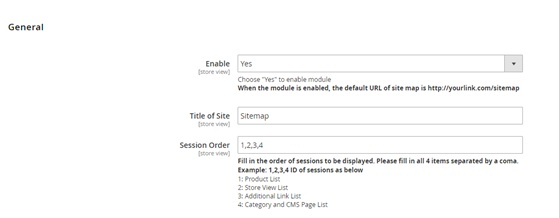
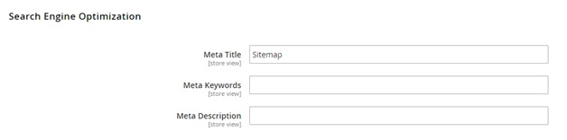
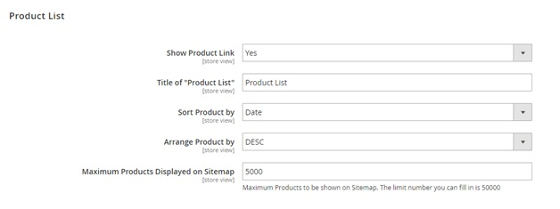
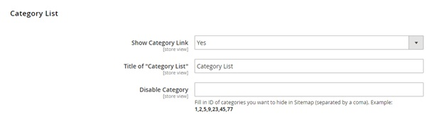
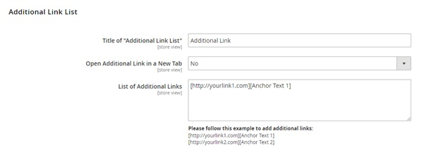
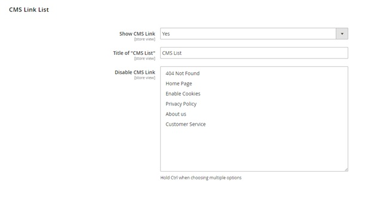

User Guide
=============

Dynamic HTML Sitemap for Magento 2 Extension Overview
----------------------------------------------------

`Dynamic HMTL Sitemap for Magento 2 <https://bsscommerce.com/dynamic-html-sitemap-for-magento-2.html>`_ by BSSCommerceis developed to generate a detailed and useful sitemap including links to 
categories, products, CMS pages and store views of your Magento 2.This module helps enhance SEO performance of your business and provide your customers with a clear structure of your site.  

How Does Dynamic HTML Sitemap for Magento 2 Extension Work?
-----------------------------------------------------------

You go to **Stores -> Configuration -> BSSCOMMERCE -> HTML Sitemap** to start setting up.

*Please flush all Magento caches after you make any configuration of the module for the changes to take effect.*

In **Enable**, choose **Yes** to enable module, otherwise choose **No**.

In **Title of Site**, choose the title for the sitemap.

In **Session Order**, fill in the order of sessions to be displayed. Please fill in all 4 items separated by a coma. ID of sessions as below:

1: Product List

2: Store View List

3: Additional Link List

4: Category and CMS Page List

In **Meta Title**, choose the meta title for your sitemap.

In **Meta Keywords**, choose the meta keywords for your sitemap.

In **Meta Description**, write meta description for your sitemap.

In **Show Product Link**, choose **Yes** to show product links in the sitemap, otherwise choose **No**.

In **Title of "Product List"**, choose the title for the product list session in the sitemap.

In **Sort Product by**, choose among **DESC** for descending or **ASC** for ascending.

In **Arrange Product by**, choose **Name/Date/Price** to sort product links.

In **Maximum Products Displayed on Sitemap**, choose the maximum for the number of product links to be shown. The limit number you can fill in is 50000.

In **Show Store View Link**, choose **Yes** to show store view links in the sitemap, otherwise choose **No**.

In **Title of "Store View List"**, choose the title for the store view list session in the sitemap.

.. image:: images/dynamic_html_sitemap_m2_4.jpg

In **Show Category Link**, choose **Yes** to show category links in the sitemap, otherwise choose **No**.

In **Title of "Category List"**, choose the title for the category list session in the sitemap.

In **Disable** Category, fill in ID of categories you want to hide in sitemap (separated by a coma). For example: 1,2,5,9,23,45,77.

In **Title of "Additional Link List"**, choose the title for the additional link list session in the sitemap.

In **Open Additional Link in a New Tab**, choose **Yes** to open additional links in a new tab, otherwise choose **No**.

In **List of Additional Links**, choose the links and the anchor you want to display for each link. Follow this example: [http://yourlink1.com][Anchor Text 1].

In **Show CMS Link**, choose **Yes** to show CMS links in the sitemap, otherwise choose **No**.

In **Title of "CMS List"**, choose the title for the CMS link list session in the sitemap.

In **Disable CMS Link**, choose the CMS links you want to hide from sitemap. Hold Ctrl when choosing multiple options.

	
.. raw:: html

   

