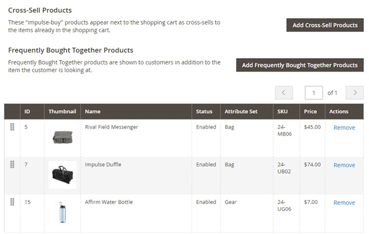
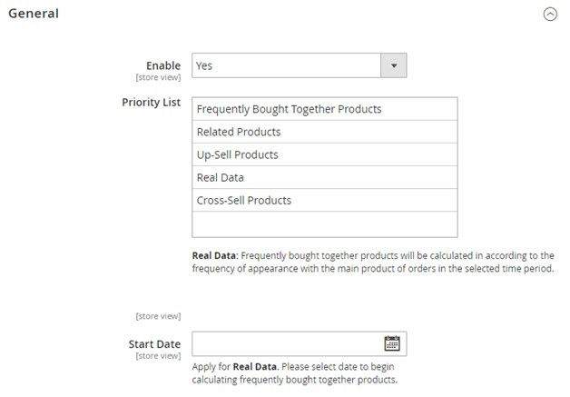
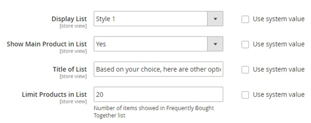
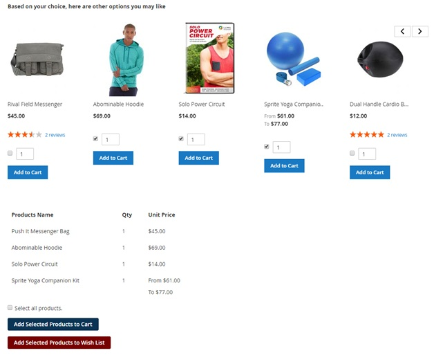
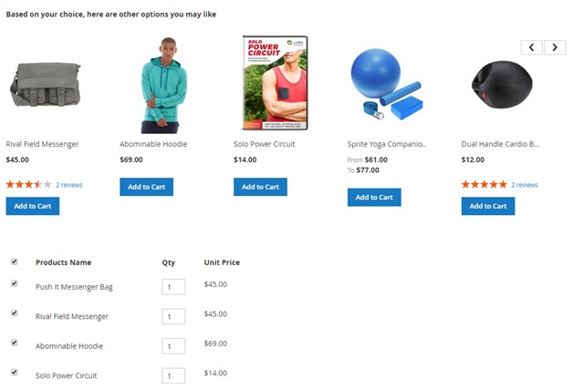
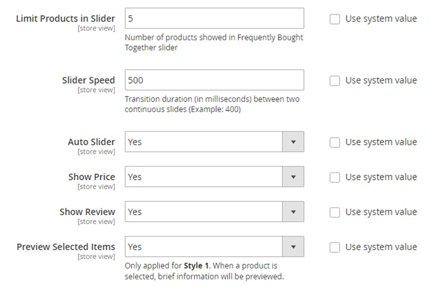
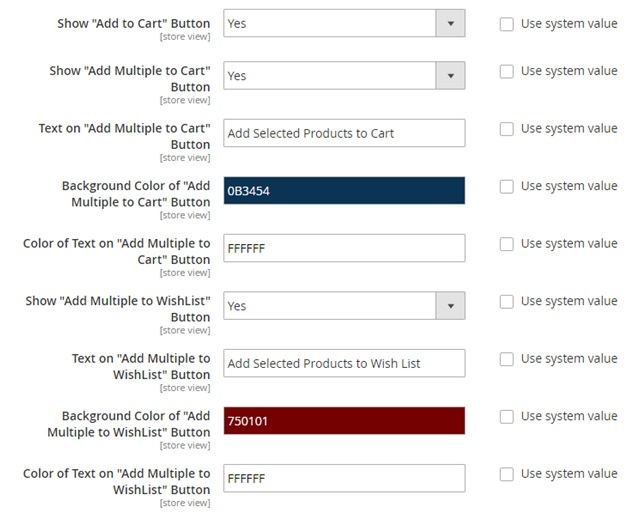
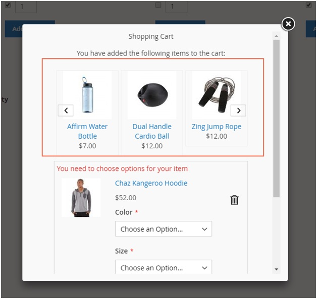
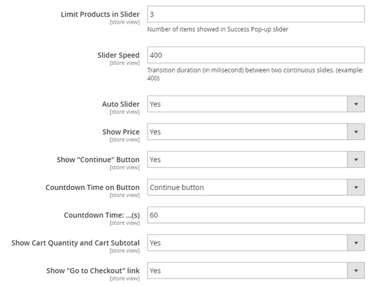
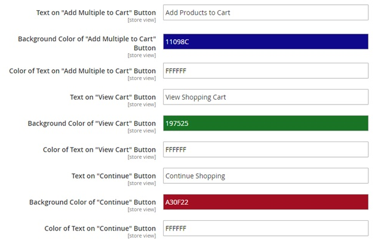

User Guide
=============

Frequently Bought Together for Magento 2 Extension Overview
-----------------------------------------------------------

`Frequently Bought Together for Magento 2 extension	<https://bsscommerce.com/magento-2-frequently-bought-together.html>`_ effectively boosts sale by suggesting products 
that are commonly bought together. The list of items can be chosen from related, cross-sell, up-sell products, or the hand-pick products set admin. The extension can 
use purchase history to track product commonly sold together and add them to the frequently block.  

How Does Frequently Bought Together for Magento 2 Extension Work?
-----------------------------------------------------------------

1. Set Frequently Bought Together List for Product
^^^^^^^^^^^^^^^^^^^^^^^^^^^^^^^^^^^^^^^^^^^^^^^^^^

Go to **Product -> Catalog -> Product Edit Page -> Related Products, Up-Sell, Cross-Sells and Frequently Bought Together**.

In **Frequently Bought Together**, add products which are commonly bought together with the main product. 

2. General
^^^^^^^^^^

Go to **Store -> Configuration -> BSSCommerce -> Frequently Bought Together -> General**. 

In **Enable**, choose Yes to enable the extension, or No to disable it.

In **Priority List**, there are five methods of selecting frequently bought together products. Drag and drop to prioritize the methods to be applied. For example: The extension 
will prioritize to choose items from Frequently Bought Together Product block. If no items found, the extension will get data from Related Products, then Up-Sell 
Product, Real Data and Cross-sell Products.

	* **Frequently Bought Together Products**: Select items from the frequently bought together product list set in 2.1.
	* **Related, Up-Sell, Cross-Sell Products**: Select items from related, up-sell, cross-sell product list. 
	* **Real Data**: Track product which are commonly sold together in purchase. The items will be calculated in according to the frequency of appearance with the main products of orders in the select time period.

In **Start Date**, select date to begin calculating frequently bought together products for Real Data method. 	

3. Frequently Bought Together List Setting
^^^^^^^^^^^^^^^^^^^^^^^^^^^^^^^^^^^^^^^^^^^

Go to **Store -> Configuration -> BSSCommerce -> Frequently Bought Together -> Frequently Bought Together List Setting.**

In **Display List**, there two ready-made design for displaying Frequently Bought Together list.

**Style 1:**

**Style 2:**

In **Show Main Product in List**, choose Yes to include the main product in Frequently Bought Together list. Choose No to exclude it. 

In **Title of List**, enter the message shown above the list. For example: Based on your choice, here are other options you may like. 

In **Limit Product in List**, restrict the number of products displayed in Frequently Bought Together list.

In **Limit Products in Slider**, restrict the number of item displayed in one slide. 

In **Slider Speed**, set transition duration between 2 continuous slides. 

In **Auto Slider**, choose Yes to enable automatic slider. No to disable this function.

In **Show Price**, choose Yes to display prices of products in Frequently Bought Together list. 

In **Show Review**, choose Yes to display reviews of products in Frequently Bought Together list.

In **Preview Selected Items**, choose Yes to enable previewing brief information of selected product in Frequently Bought Together list. The information includes product name, quantity, and unit price. 

In **Show "Add to Cart" button**, choose **Yes** to **display "Add to Cart" button**.

Config customize **"Add Multiple to Cart" button:**
 
	* Show "Add Multiple to Cart" button.
	* Text on "Add Multiple to Cart" button.
	* Background Color of "Add Multiple to Cart" button.
	* Color of Text on "Add Multiple to Cart" button.
	
Config customize **"Add Multiple to Wishlist" button**:

	* Show "Add Multiple to Wishlist" button.
	* Text on "Add Multiple to Wishlist" button.
	* Background Color of "Add Multiple to Wishlist" button.
	* Color of Text on "Add Multiple to Wishlist" button.

4. Pop-up Setting
^^^^^^^^^^^^^^^^^^

Go to **Stores -> Configuration -> BSSCommerce -> Frequently Bought Together -> Pop-up Setting.**

When adding products in Frequently Bought Together list to cart, the extension will work like `Add Multiple Products to Cart <https://bsscommerce.com/magento-2-add-multiple-products-to-cart.html>`_ . There 
are two ways to add product in Frequently Bought Together list to cart:

	* Add each product to cart separately: Display success pop-up, choose option/quantity in pop-up for product with options. 
	* Add multiple products to cart: Tick on products and click "Add Multiple to Cart" button. The products added to cart successfully will be displayed in slider of success pop-up. For products with options, customer can select options/quantity right from pop-up. 

:step:`*Note`:
	
* To add all product in Frequently Bought Together list, tick on "Select all product" then click "Add Multiple to Cart" button.
* To add selected products to wishlist, click "Add Multiple toWishlist" button.

In **Limit Product in Slider**, restrict the number of products displayed in slider of success pop-up. 

In **Slider Speed**, set transition duration between two continuous slides. 

In **Auto Slider**, choose Yes to enable automatic slider. 

In **Show Price**, choose Yes to display price of product. 

In **Show "Continue" button**, choose Yes to display "Continue Shopping" button. 

In **Countdown Time on Button**, set countdown function for "Continue" button or "View Cart" button. 

In **Countdown Time**, set countdown time. 

In **Show Cart Quantity and Cart Subtotal**, choose Yes to display total items in cart and cart subtotal. 

In **Show "Go to Checkout" Link**, choose Yes to display "Go to Checkout" link. 

Config customize **"Add Multiple to Cart" button:** 

	* Text on "Add Multiple to Cart" button.
	* Background Color of "Add Multiple to Cart" button.
	* Color of Text on "Add Multiple to Cart" button.
	
Config customize **"View Cart" button:**
 
	* Text on "View Cart" button.
	* Background Color of "View Cart" button.
	* Color of Text on "View Cart" button.
	
Config customize **"Continue" button:**

	* Text on "Continue" button.
	* Background Color of "Continue" button.
	* Color of Text on "Continue" button.

	
	
.. raw:: html

   

