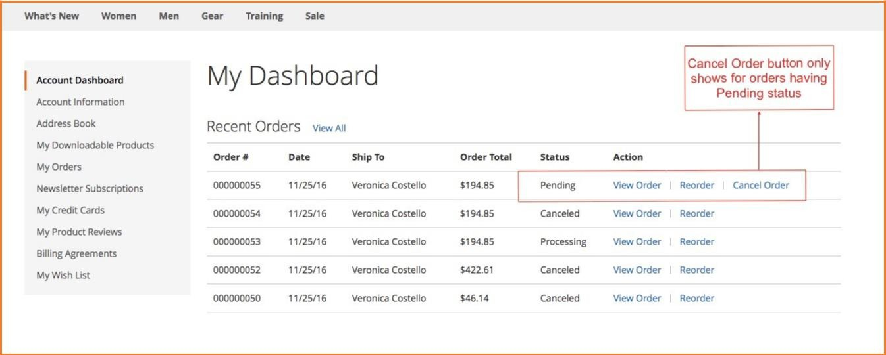
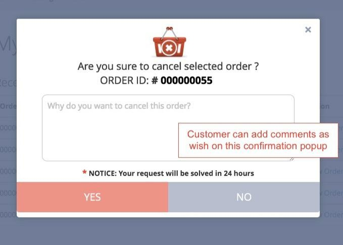
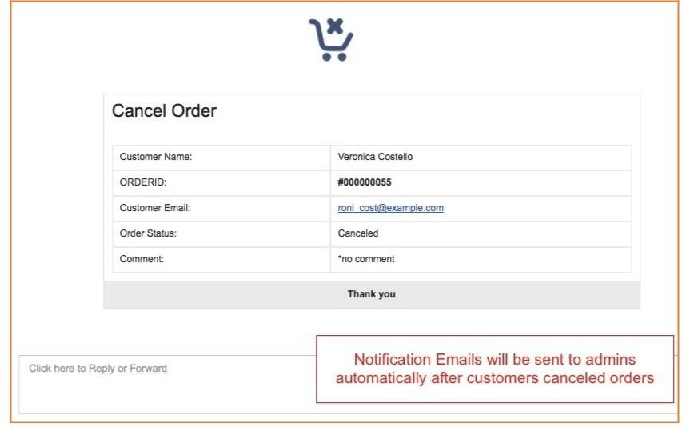
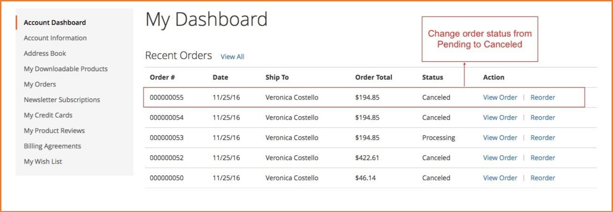
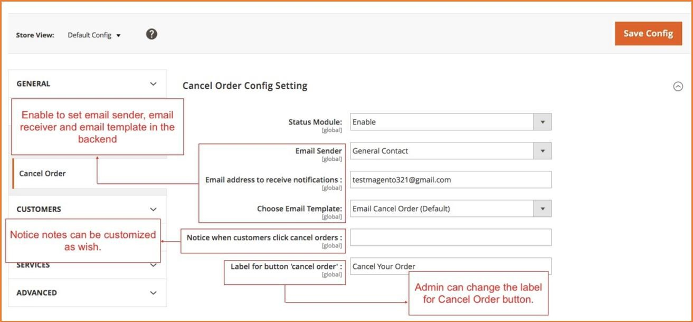

User Guide
=============

Frontend Cancel Order for Magento 2 Overview
--------------------------------------------

As you know, the default of Magento does not allow customers to cancel orders from the frontend, which causes some inconvenience for them when 
shopping, hence, our `Frontend Cancel Order for Magento 2 <http://bsscommerce.com/magento-2-frontend-cancel-order.html>`_ module totally completes this missing 
feature of Magento. The extension is developed to help customers cancel their orders with Pending status from My Account dashboard and My Order page in the 
frontend. Frontend Cancel Order for Magento 2 definitely brings more convenience for customers and enhance their shopping experience.

How does Frontend Cancel Order for Magento 2 work?
---------------------------------------------------

1. Functions of Frontend Cancel Order for Magento 2
^^^^^^^^^^^^^^^^^^^^^^^^^^^^^^^^^^^^^^^^^^^^^^^^^^^

* Allow customers to cancel orders from the frontend: Customers need to login, then go to **My Account -> Account Dashboard** or **My Orders.**

* Allow customers to add comments in a confirmation popup: When customers click Cancel Order button, there will be a confirmation popup which allows them to enter comments.
	
	* If they click Yes, orders will be canceled.

	* If they still do not want to cancel orders, they can choose No.

* Send Notification Emails to admins automatically after customers canceled orders

* Change order status from Pending to Canceled and auto restock products

2. How to configure Frontend Cancel Order for Magento 2 in the backend
^^^^^^^^^^^^^^^^^^^^^^^^^^^^^^^^^^^^^^^^^^^^^^^^^^^^^^^^^^^^^^^^^^^^^^

* Go through **System -> Configuration -> BSSCommerce -> Cancel Order**

* **Status Module:** Choose **Enable** to ativate the module

* **Email Sender:** admin can set which email will be email sender

* **Email Address to receive notification:** enable to set which email will receive notification emails

* **Choose Email Template:** admin can configure to choose email template for the notification emails

* **Notice when customers click cancel orders:** admin can customize Notice Note in the confirmation popup when customers click cancel orders.

* **Label for button cancel order:** change the label of Cancel Order button

* **NOTE:** If you want to customize Email Template to have more choices in **Choose Email Template**, follow these steps:
	
	* Go to **Marketing -> Communications -> Email Templates -> Add New Template**
	
	.. image:: images/frontend_cancel_orders_m2_6.jpg
	
	* In **Load default template**, choose **Template** you want, then click **Load Template**
	
	* In **Template Information**, enter text as you want in **Template Name, Template Subject.**

	* In **Template Content** and **Template Styles**, you can edit html or css as you want.

	.. image:: images/frontend_cancel_orders_m2_7.jpg

.. raw:: html

   

