User Guide
=============

Google AMP Extension for Magento 2 Overview
-------------------------------------------

Google AMP -  Accelerated Mobile Pages is the hottest trending technology for a faster and smoother loading for mobile web pages. With the ability to be loaded in just few 
seconds, the new mobile pages will increase user engagement on your store and drop the exit rate. `Google AMP Extension for Magento 2 <https://bsscommerce.com/google-amp-extension-for-magento-2.html>`_  by 
BSSCommerceis an effective tool to generate and customize AMP pages for your site as your wishes.

How Does Add Google AMP Extension for Magento 2 Work?
-----------------------------------------------------

1. How to create and customize Magento 2 AMP pages
^^^^^^^^^^^^^^^^^^^^^^^^^^^^^^^^^^^^^^^^^^^^^^^^^^^

The module will auto-generate the category page and product page for your Magento 2 store. For the homepage and parent category, admins will have 
to create by themselves using the AMP widgets provided by the extension. Please follow the steps below to create and customize your own AMP pages in Magento 2

.. image:: images/google_amp_m2_1.jpg

Please go to **Admin -> Content -> Pages -> Add New Page** and start configuration.

Set a name for the Page in **Page Title**.

In **Content**, choose **Insert Widget**.

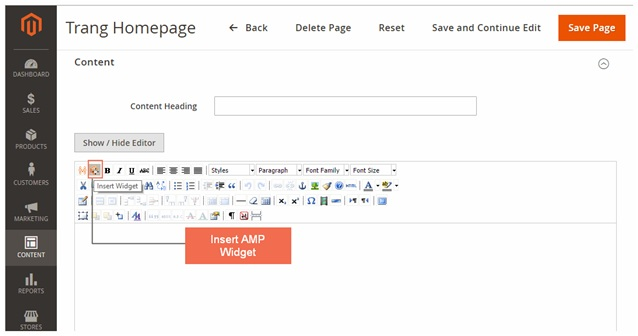

In **Widget Type**, please select among 6 AMP Widget Types including: **Product list, Banner, Iframe, Social Share, Youtube and Image**.

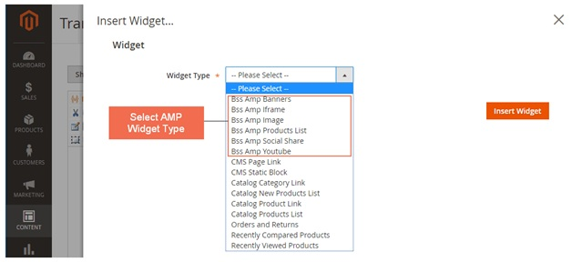

In the following parts, we will introduce how to configure each type of AMP widgets provided by the extension.

2. AMP Product List Widget
^^^^^^^^^^^^^^^^^^^^^^^^^^^

.. image:: images/google_amp_m2_4.jpg

In **Title**: Fill in the text displaying above the products.

In **Height**: Choose height for product slider.

In **Number of Products to Display**: Choose the number of products which will be shown.

In **Image Height**: Choosethe height of product image.

In **Image Width**: Choosethe width of product image.

In **Condition**: Choose the condition for products which will be shown.

3. AMP Banner Widget
^^^^^^^^^^^^^^^^^^^^

Please go to **Admin -> BSSCommerce -> AMP Banner -> Create New Banner** and start configuration.

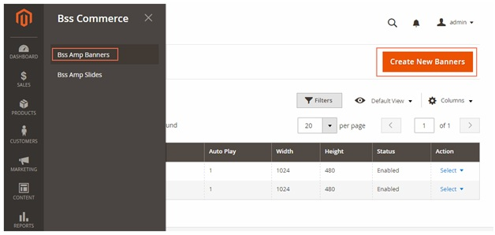

In **Enable**: Choose Yes.

In **Name**: Choose the name for the banner (for management purpose at backend only, not to be displayed at frontend).

In **Autoplay**: Choose Yes for the banner to be auto played, otherwise choose No.

In **Width**: Choose the width for the banner.

In **Height**: Choose the height for the banner.

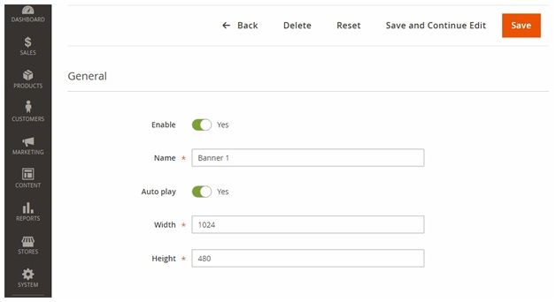

In the next step, we will make a slide for the above banner.

Please go to **Admin -> BSSCommerce -> AMP SlidesCreate New Slides** and start configuration.

In **Enable**: Choose Yes.

In **Banner**: Choose the banner which you just created

In **Title**: Choose the title for the slide (displayed in frontend).

In **Link**: Choose a link where customer will be directed to once clicking on the banner.

In **Caption**: Choose the caption which will be displayed under the image.

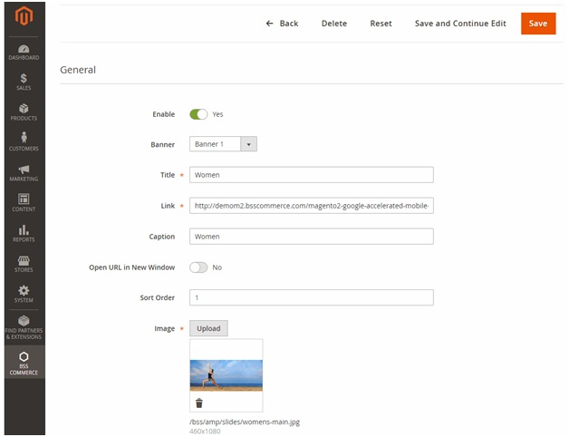

In **Open Url in a New Window**: Choose **Yes** for the link to be displayed in a new window, otherwise choose **No**.

In **Sort Order**: Choose the order of the image in the slide.

In **Image**: Upload the image you want to display.

Repeat these steps for all the images you want to be displayed in the slide. The slide can include many images. Below is an example of the images we put in the slide for homepage.

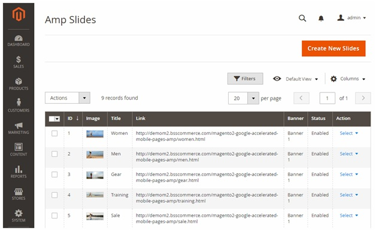

After finishing making the slide for the AMP banner, insert the banner in the AMP page.

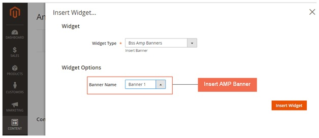

4. AMP Iframe Widget
^^^^^^^^^^^^^^^^^^^^

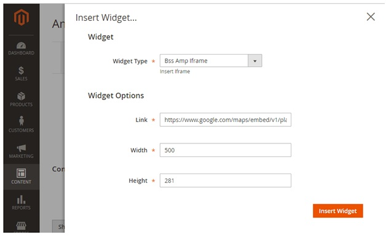

In **Link**: Choose the link to the Iframe.

In **Width**: Choose the width for the Iframe.

In **Height**: Choose the height for the Iframe.

5. AMP Social Share Widget
^^^^^^^^^^^^^^^^^^^^^^^^^^

There are 8 types of available social share including **Facebook, Email, Gplus, Linkedin, Pinterest, Tumblr, Twitter and Whatsapp**. 

Choose **Yes** to enable otherwise choose **No**.

For **Facebook**, please fill in app ID.

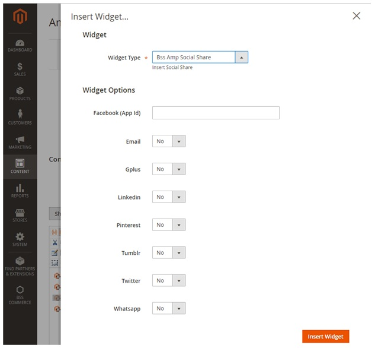

6. AMP Youtube Widget
^^^^^^^^^^^^^^^^^^^^^

In **Youtube ID**: Choose the text after “https://www.youtube.com/watch?v=”.

In **Autoplay**: Choose **Yes** for the video to be auto played, otherwise choose **No**.

In **Width**: Choose the width for the video.

In **Height**: Choose the height for the video.

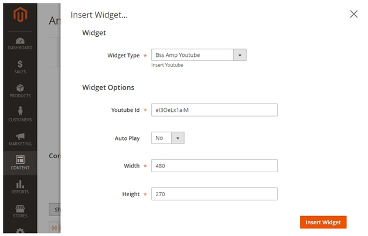

7. AMP Image Widget
^^^^^^^^^^^^^^^^^^^

In **Image**: Choose the image you want to display.

In **Alt**: Choose Alt text for the image.

In **Width**: Choose the width for the image.

In **Height**: Choose the height for the image.

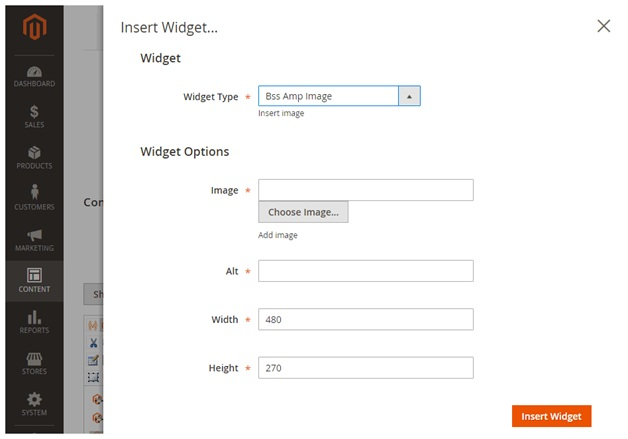

8. General Configuration
^^^^^^^^^^^^^^^^^^^^^^^^

Please go to **Store -> Configuration -> BSS COMMERCE -> Accelerated Mobile Pages** and start configuration.

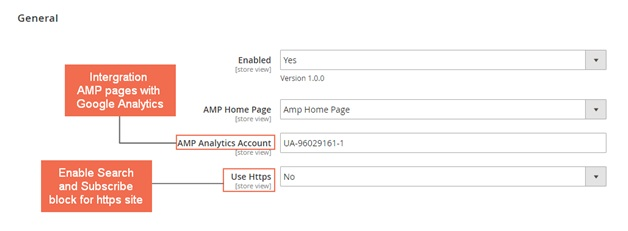

In **Enabled**: Choose Yes to enable the module, otherwise choose **No**.

In **AMP Homepage**: Choose the page you created to be AMP Homepage.

In **AMP Analytics Account**: Fill in the ID of your Google Analytics account to integrate AMP pages to Analytics.

In **Use Https**: This configuration works for https website only. Choose **Yes** to display **search box and subscription box**, otherwise choose **No**. If your site is not using https, please choose **No**.

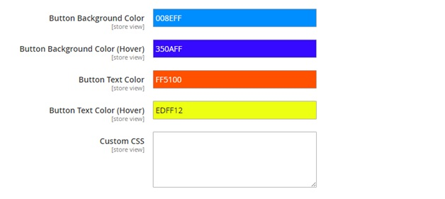

In **Button Background Color**: Choose the background color for button on AMP pages.

In **Button Background Color (Hover)**: Choose the background color for button on AMP pages when hovering.

In **Button Text Color**: Choose the color for text on button on AMP pages.

In **Button Text Color (Hover)**: Choose the color for text on buttonon AMP pages when hovering.

In **Custom CSS**: Set the CSS for all AMP pages.

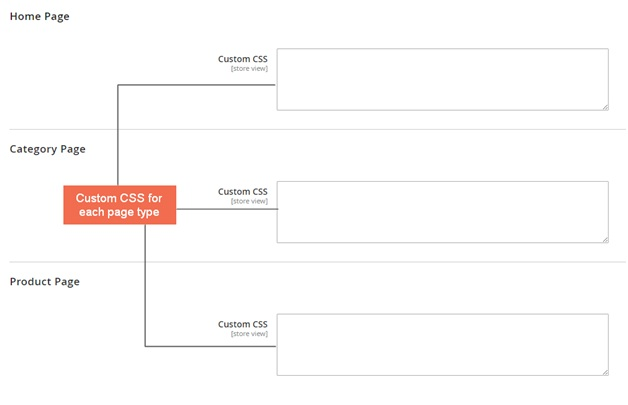

In **Custom CSS for Home Page/ Category Page/Product Page/**: Set the CSS for each type of AMP page.

9. Note
^^^^^^^

* All the CSS configuration must follow AMP standard. Please visit https://www.ampproject.org/ to know more details about the standard.
* To validate your AMP pages, please use these three tools:
* https://search.google.com/search-console/amp
* https://validator.ampproject.org
* AMP Validator Extension available for Chrome and Opera

	
.. raw:: html

   

