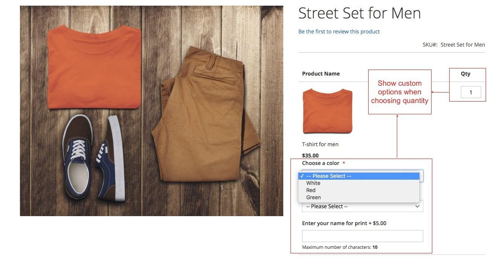
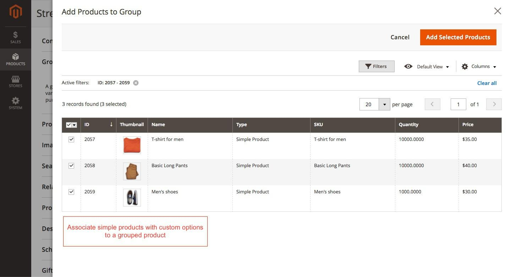
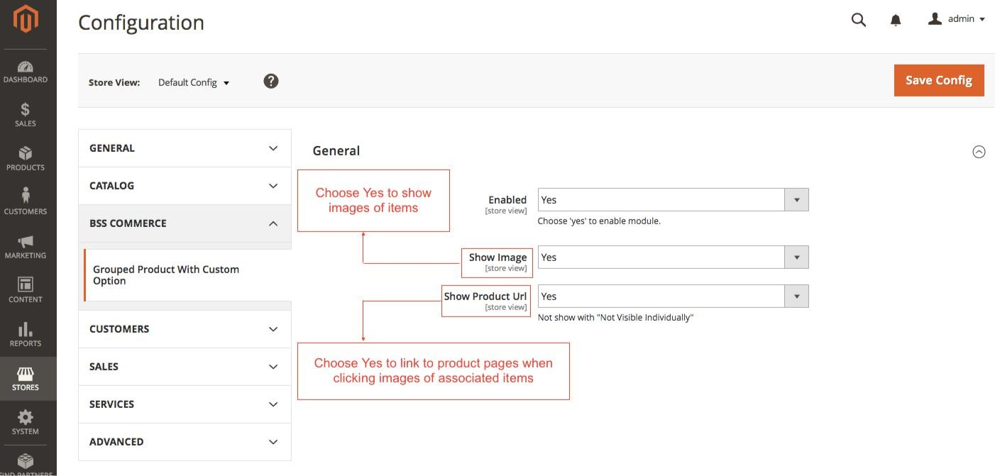

User Guide
=============

Grouped Product with Custom Options for Magento 2 overview
--------------------------------------------------------------

Grouped Product is an amazing type of product that supports showing multiple products for order on a single page. However, as you know, the default of 
Magento only allows admin to add simple products without custom options to a grouped 
product. Whereas, with `Grouped Product with Custom Options for Magento 2 <http://bsscommerce.com/magento-2-grouped-product-with-custom-options.html>`_ supports 
adding simple products with custom options to a grouped product, which makes customers purchase grouped product conveniently when having more choices to select 
their wanted attributes of products. Moreover, Grouped Product with Custom Options for Magento 2 helps to show custom options of associated products when 
customers set quantity which helps to have an economy space and make beautiful sliding effect for grouped product pages.

How Grouped Product with Custom Options for Magento 2 works
-----------------------------------------------------------

1. At the frontend
^^^^^^^^^^^^^^^^^^

All custom options of simple product will be shown up only when customers choose quantity.

2. At the backend
^^^^^^^^^^^^^^^^^

**2.1. Add simple products with custom options to a grouped product**

* At first, you need to create custom options for simple products.

* Then, add simple products with custom options to grouped product:

	* Go to **Product -> Catalog**

	* Choose a grouped product you need to add simple product with custom options.

	* At **Grouped Products** tab, click **Add Products to Group**, then select simple products with custom options.

	* Next, choose **Add Selected Products**.

	* **Save.**

**2.2. Make configuration for module**

Now you enable this module as follow: Go to **Stores -> Configuration**

* **Enabled:** choose **Yes** to enable the module.

* **Show Image:**

	* Choose **Yes** if you want to show image of simple product with custom options.

	* If you do not want that, choose **No**.

* **Show Product URL:**

	* Choose **Yes** if you want to link to product page of associated product with custom options.
	
	* Choose **No** if you do not want.

	
	
.. raw:: html

   

