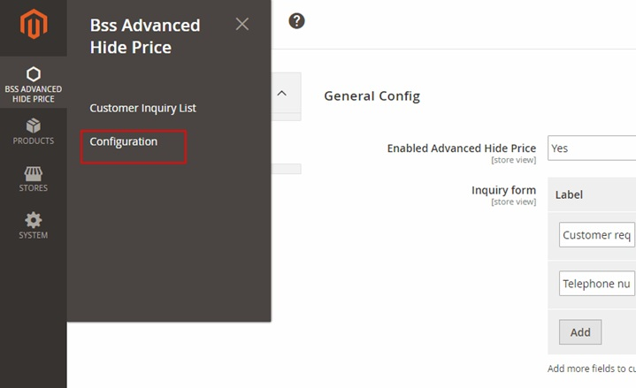
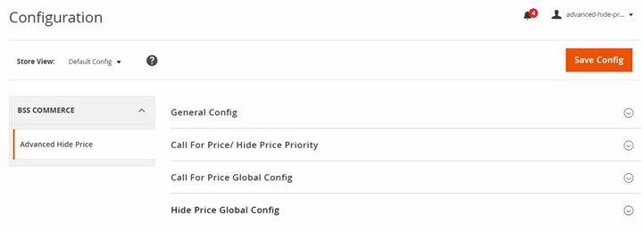
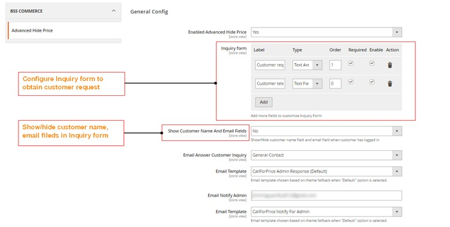
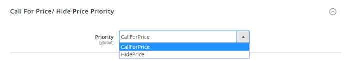
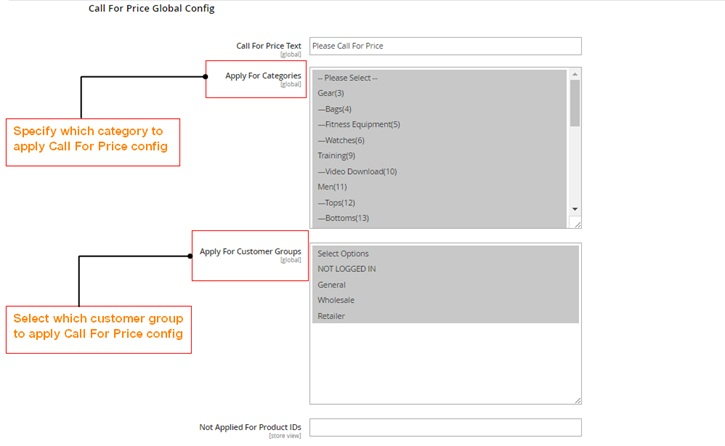
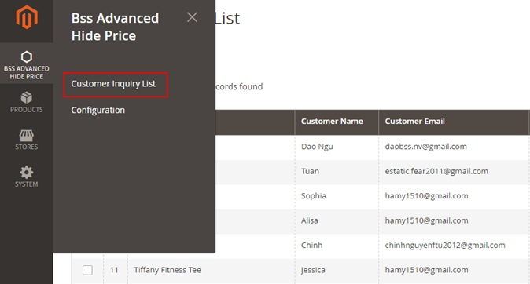
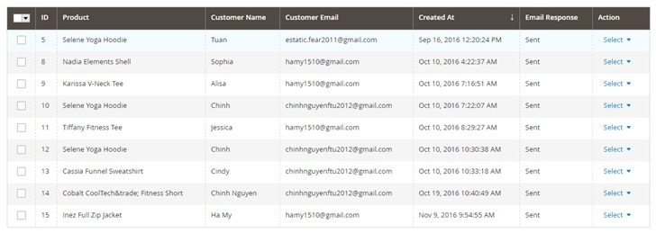
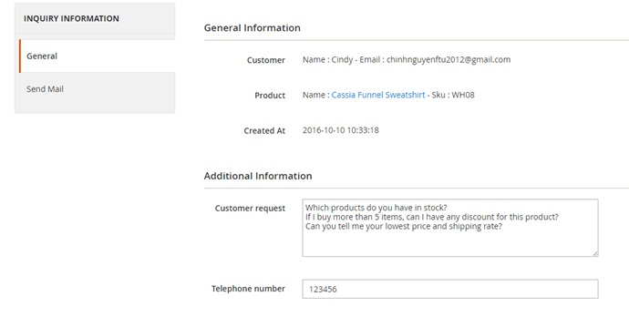
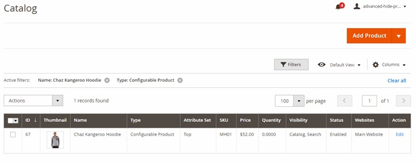
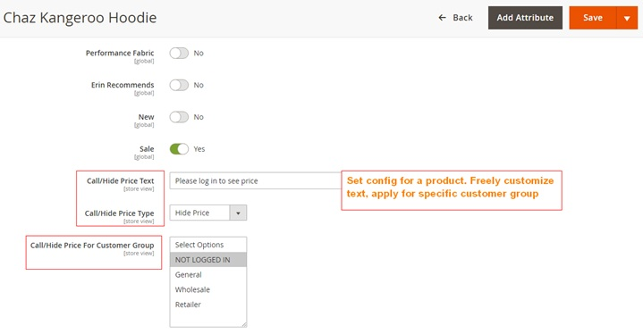

User Guide
=============

Hide Price/Call For Price for Magento 2 Extension Overview
------------------------------------------------------------

`Advanced Hide Price for Magento 2 <http://bsscommerce.com/magento-2-hide-price-call-for-price.html>`_ is an extension that allows to 
flexibly hide price for a particular product, a certain category, or specific customer groups. Besides hiding price, the extension also hide "Add to Cart" button 
and replace it with a custom message or a Call For Price button that link to an Inquiry form in Ajax popup to obtain customer's request.

How does Hide Price/Call For Price for Magento 2 Extension work?
----------------------------------------------------------------

1.	In Configuration
^^^^^^^^^^^^^^^^^^^^^

Navigate to **BSS Advanced Hide Price -> Configuration**

In **Configuration**, there are four main sections: General Config, Call For Price/Hide Price Priority, Call For Price Global Config and Hide Price Global Config

**1.1.	In General Config**

In **Enabled Advanced Hide Price**, choose **Yes** to enable the extension or **No** to disable it. 

In **Inquiry Form**, customize the inquiry form by adding/ deleting fields in the form to obtain customer requests. Filling in the following options:

	*	Decide filed name in **Label**. E.g: Customer request.
	
	*	Decide filed type in **Type**. There are 3 options to select: Text Field, Text Area, Checkbox. 

	*	Decide the order of the field in Inquiry Form in **Order**.
	
Tick **Required** and **Enable** checkbox to enable the field, or click action button to discard it. 

In **Show Customer Name and Email**, choose No to exclude Name and Email field in Inquiry Form if customers have logged in their accounts on 
site. Otherwise choose Yes to include these filed for both logged-in and non-logged-in customers. 

In **Email Answer Customer Inquiry**, select an email to send reply to customer’s request then select **Email Template**.

In **Email Notify Admin**, fill in your email to immediately receive email notifying customer request, then select **Email Template**. 

**1.2.	In Call For Price/Hide Price Priority**

Prioritize Call For Price or Hide Price Config by selecting that config in **Call For Price/Hide Price Priority**.

**1.3.	In Call For Price Global Config**

In **Call For Price Text**, enter a text to display in Call For Price button which is in replace of Add to Cart button. 

In **Apply For Categories**, select which categories to apply Call For Price config. Choose one, multiple or all categories. 

In **Apply For Customer Groups**, select which customer groups to apply Call For Price config. Choose one, multiple or all customer groups.

In **Not Applied For Product IDs**, enter ID of products to exclude from applying Call For Price config. 

**1.4.	In Hide Price Global Config**

In **Hide Price Text**, enter a text to display in custom message which is in replace of Add to Cart button.

In **Apply For Categories**, select which categories to apply Hide Price config. Choose one, multiple or all categories. 

In **Apply For Customer Groups**, select which customer groups to apply Hide Price config. Choose one, multiple or all customer groups. 

In **Not Applied For Product IDs**, enter ID of products to exclude from applying Hide Price config. 

2.	In Customer Inquiry List
^^^^^^^^^^^^^^^^^^^^^^^^^^^^

Go to **BSS Advanced Hide Price -> Customer Inquiry List**

In **Customer Inquiry List**, check the list of customers who have sent requests with information, including: ID (ID of request), product name, customer name, 
customer email, created at (time and date when customers sent request), email response and action. 

In **Action**, choose **View** in dropdown **Select** to navigate to inquiry information page. 

**2.1.	In General Information**

Check information of the request sent from customer, including general information and additional information.

**2.2.	In Send Mail**

In **Send Email**, fill in a number to notify customer of price for the requested product in **Price For Request**. 

Enter a comment to answer customer inquiry if needed in **Comment**.

Finally, click **Send Email for Customer** button. 

3.	In Catalog
^^^^^^^^^^^^^^^

Navigate to **Products -> Catalog**

In **Catalog**, search for a product that you want to apply Hide Price or Call for Price config. 

In **Action**, click **Edit** to go to Product Edit page. Scroll down to find Hide Price/Call For Price config. 

In **Call/Hide Price type**, decide the config you want to apply for that specific product.

In **Call/Hide Price text**, enter a text to display in place of Add to Cart button 

In **Call/Hide Price For Customer Group**, select which customer to apply config. 

.. raw:: html

   

