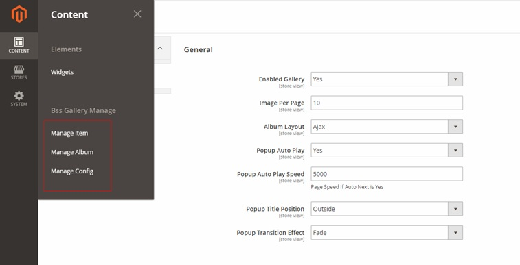
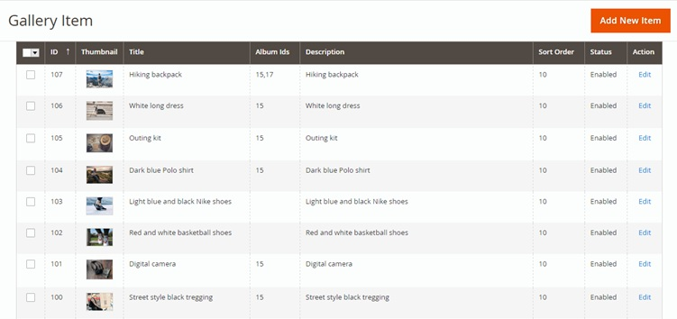
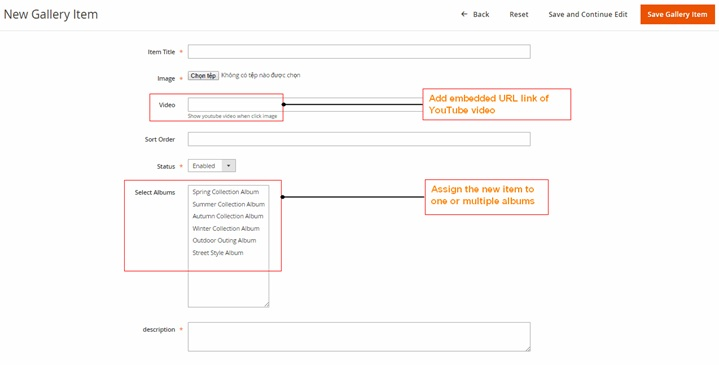
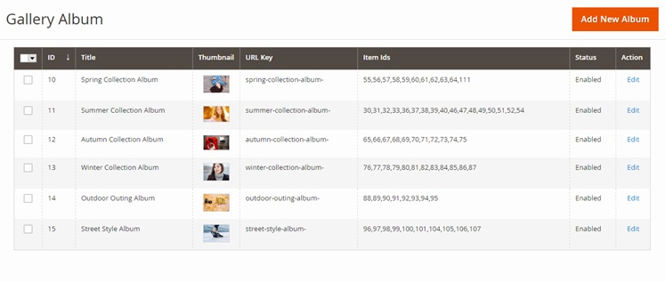
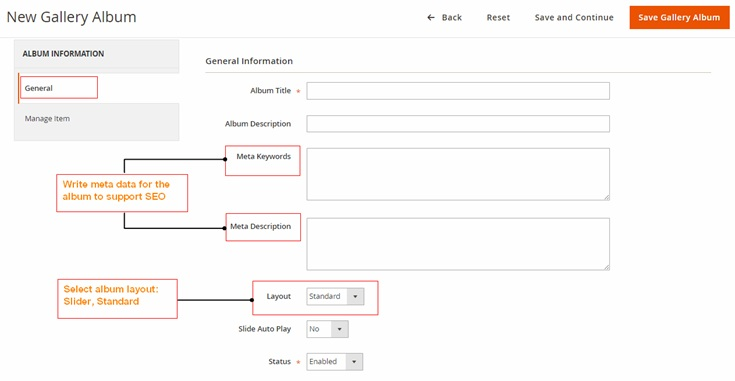
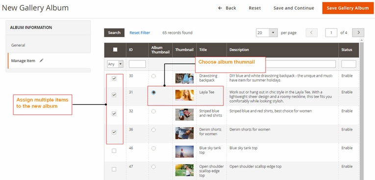
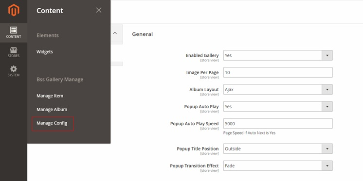
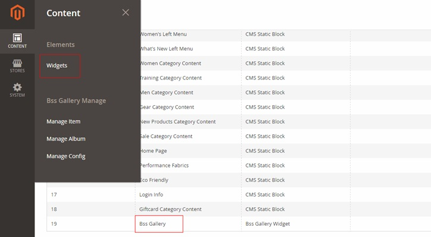
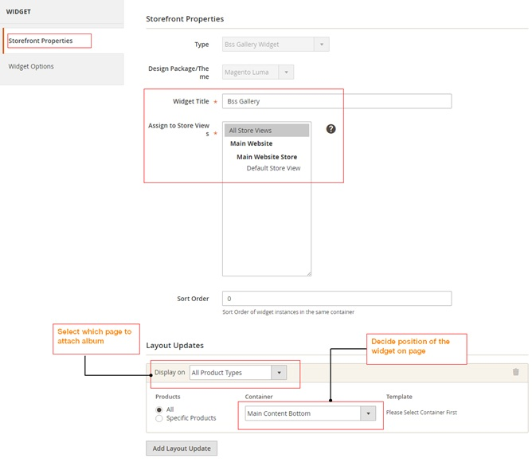
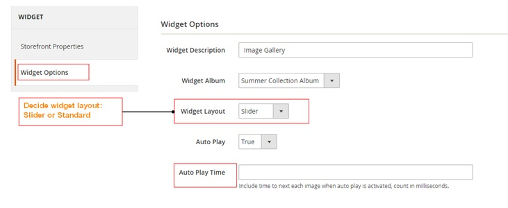

User Guide
=============

Image Gallery for Magento 2 Extension Overview
----------------------------------------------

`Image Gallery for Magento 2 <http://bsscommerce.com/magento-2-image-gallery.html>`_ allows admin to create image gallery from scratch, including uploading 
images, adding new albums, and configuring for each image and album regarding its content, layout and display effect. It is an optimal tool to help admin manage 
all products' images and provide better visualization of product for customer thanks to widget support and full responsiveness. 

How does Image Gallery for Magento 2 Extension work?
----------------------------------------------------

1. In Manage Item 
^^^^^^^^^^^^^^^^^

Please navigate to **Content -> BSS Gallery Manage -> Manage Item**

See the list of items here with concise presentation of information including: title, album ids (which albums the item belongs to), description, sort 
order, status (enabled/disabled), action (click here to edit item information) 

* Click **Add New Item** to include a new item into album

* In **Item Title**, pick title for the new item; then upload image for the new item in **Image**
 
* If your item is a video which has already been uploaded on YouTube, add the embedded url link in **Video**
 
* Fill in the information in **Sort Order** and set **Status** as Enabled

* Finally, choose one or multiple albums to assign your new item in **Select Albums** and write its description if needed in **Description**. 

2.	In Manage Album
^^^^^^^^^^^^^^^^^^^

Please navigate to **Content -> BSS Gallery Manage -> Manage Album** 

See the list of albums here with concise presentation of information including: title, thumbnail (choose a picture in the album to be album thumbnail), url 
key (automatically updated based on album title, item ids (show items included in album), status (enabled/disabled), action (click here to edit item information)

* If you want to add new albums into gallery, click Add New Album  

In **New Gallery Album -> Album Information -> General**

* In **General Information**, decide **Album Title**, write **Album Description** if needed, then write meta data in **Meta Keywords** and **Meta Description** to support SEO. 

* Then, choose album layout type in **Layout**: Standard or Slider. 

* If you want to set automatic sliding action for your album then choose Yes in **Slide Auto Play**, otherwise choose No.

* In **Status** choose Enabled to activate the new album otherwise choose Disabled.

* In **New Gallery Album -> Album Information -> Manage Item**

In **Manage Item**, choose one or several items to add to the new album, then in **Album Thumbnail**, choose an item to be album thumbnail 

3.	In Manage Config
^^^^^^^^^^^^^^^^^^^^

Please navigate to **Content -> BSS Gallery Manage -> Manage Config**

.. image:: images/image_gallery_3_2.jpg

* In **Enabled Gallery**, choose Yes to enable the gallery, otherwise choose No.

* In **Image Per Page**, limit the display of number of items for each page.

* In **Album Layout**, choose one of the two available of album layout: Ajax or Standard.

* In **Popup Auto Play**, choose Yes to enable automatic next image for the gallery, then decide next speed in **Popup Auto Play Speed**; otherwise choose No. 

* Then, decide position of fancybox title in **Popup Title Position** with 3 options, including: Over, Inside, and Outside. 

* Choose the wanted effect of image display for Popup in **Popup Transition Effect** with 3 options: Fade, Elastic, or None.

4.	In Widgets 
^^^^^^^^^^^^^^

Please navigate to **Content -> Elements -> Widgets -> Bss Gallery**

In **Bss Gallery -> WIDGET -> Storefront Properties**

In **Storefront Properties**, choose title for the widget in **Widget Title**, and pick which store view to place widget: All Store View, Main Website, Main 
Website Store, Default Store View. 

In **Layout Updates**, choose which category/product type/page for gallery displaying in **Display On**, click to see drop down and pick an option among the 
available list, including: Categories (Anchor Categories, Non-anchor Categories), Products (All Product Types, Simple Product, Virtual Product, Bundle 
Product, Downloadable Product, Grouped Product, Configurable Product), Generic Pages (All Pages, Specified Page, Page Layouts). 

In **Container**, choose an option among the available list of position in drop down to place widget on page. 

In **Bss Gallery -> WIDGET -> Widget Options**

* In **Widget Description**, write description for the widget. 

* In **Widget Album**, choose which album to be displayed on widget.

* In **Widget Layout**, choose one of the 2 layout types for widget: Slider, or Standard. 

* If choose Slider for Widget Layout, select True to enable **Auto Play**, otherwise select False, then fill in **Auto Play Time** if needed 

.. raw:: html

   

