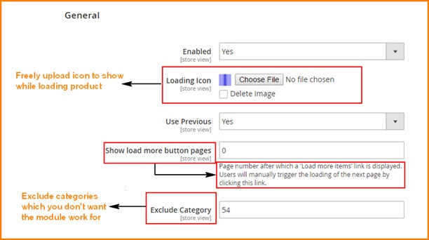
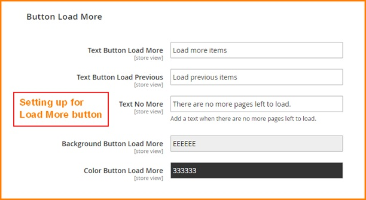

User Guide
=============

Infinite Scroll for Magento 2 Extension Overview
-------------------------------------------------

In Magento 2 default, in product pages such as catalog or search result, pagination will be displayed at the end of each page as an option to load the next 
pages. With this function, users only can load the next page one by one. In general, it is not convenient for users if there are a great numbers of pages. To 
optimize the searching experience for Magento users, BSSCommerce quickly 
develops `Infinite Scroll for Magento 2 Extension <http://bsscommerce.com/magento-infinite-scroll-for-magento-2.html>`_ - providing new functions that give 
admin more choices in setting up how to load the next pages: automatically load with Ajax when customers scroll down to the end of pages, free to customize Load 
More button/ Back to Top button, create smart URL. Besides, admin can choose which categories the module will work for. Our extension will contribute to making 
your site become more professional and user –friendlier. 

How does Infinite Scroll for Magento 2 Extension work?
------------------------------------------------------

To make configuration of this module, follow these below instruction:

* Step 1: Go to **Admin Panel => Store => Configuration**

* Step 2:  At the left side of the page, find **BSS Commerce** => select **Infinite Scroll**
 
There are 3 main parts you can fix as your wishes: General, Go To Top, Button Load More

1. General
^^^^^^^^^^

* **Enabled**

Choose Yes/ No to enable/ disable module 

* **Loading Icon**

Click button Choose File -> Select an image file from your computer location. This image will be used as icon displayed while loading product with Ajax

Click Delete Image if you want to use default icon

* **Show load more button pages**

Add a page number into this field. Once set up, when auto ajax loading till this page number, a button will be display for users to load the next pages manually.
 
If you set up this field to 0, there will be no Load More button.

If you set up this field to 1, Load More button will be displayed right at the first page

You can customize Load More button in the following box.

* **Exclude Category **

Add ID of categories which you don’t want the module work for

2. Button Load More
^^^^^^^^^^^^^^^^^^^

You can set up button Load More as wish in term of:

* guiding texts

* background color

* Trigger

* Location

* Speed

.. image:: images/infinite_scroll_m2_2.jpg

3. Button Load More
^^^^^^^^^^^^^^^^^^^

You can set up button Load More as your wish in term of guiding texts and background color for button. 

.. image:: images/infinite_scroll_m2_3.jpg

.. raw:: html

   

