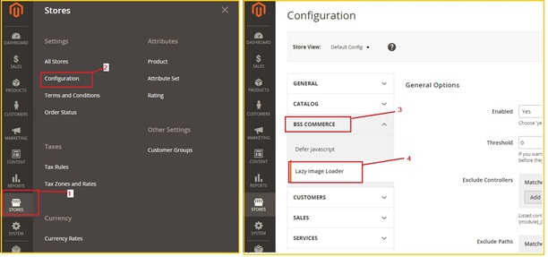
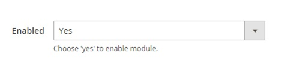
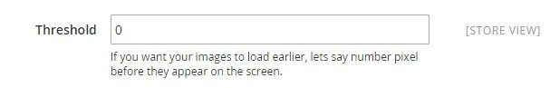

User Guide
=============
I.	BSS Lazy Image Loader for Magento 2 Extension Overview
----------------------------------------------------------------

BSS Lazy Image Loader 2 extension serves Magento 2 based website. It not only creates eye-catching image emerging transition but also optimizes Magento 2 
site speed. Especially, the extension is developed with SEO which promotes site rank in the SERPs.

II.	How does BSS Lazy Image Loader for Magento 2 extension work?
----------------------------------------------------------------
To make configuration of this module, follow these below instruction:

* Step 1: Go to **Admin Panel** => **Stores** => **Configuration**

* Step 2:  At the left side of the page, find **BSS Commerce** => select **Lazy Image Loader**

After these 2 steps, a screen for configuration appears like the below picture:

There are 5 parts you can fix as your wishes: Enabled, Threshold, Exclude controllers, Exclude path, Exclude Home Page.

1.	Enabled
^^^^^^^^^^^^^^^

You can select between enable and disable BSS Lazy Image Loader for Magento 2 Extension by setting the status in **Enabled** box into "Enable" or "Disable".

2.	Threshold
^^^^^^^^^^^^^^^

In **Threshold** box, you can set the number pixel before image appear on the screen,  then the image will be loaded earlier as the pixels you set. 
For instance, if you set the number in the box is 14, it means that the images will be loaded before when your  scroll position is far from 14 pixels.

3.	Exclude controllers, Path, Homepage
^^^^^^^^^^^^^^^^^^^^^^^^^^^^^^^^^^^^^^^

BSS Lazy Image Loader for Magento 2 Extension allows admin deciding which part will be excluded from lazy-loaded function. To exclude controller, admin can 
click on **Add** and then filling the match in the box. Admin also can delete the Match and and add more by clicking on **Delete**, and **Add** button alternately.

.. image:: images/lazy_image_loader_4.jpg

Similar to **Controller**, admin can control the **Path** which they do not want to  be affected by lazy image load.

.. image:: images/lazy_image_loader_5.jpg

Finally, admin can set whether Homepage be affected by lazy image load or not in the box **Exclude Home Page**.

.. image:: images/lazy_image_loader_6.jpg

After finishing all of these set-up steps, you can click on **Save Config** button to start using 
`Lazy Image Loader for Magento 2 extension <http://bsscommerce.com/magento-lazy-image-loader-extension-for-magento-2.html>`_ .
