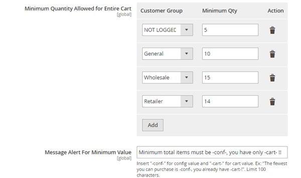

User Guide
=============

Limit Cart Quantity For Magento 2 Overview 
------------------------------------------

Setting up a limit for order quantity is an essential need for many store owners as it has a remarkable effect on sales policy. However, the default Magento is 
able to support few of those demands. Hence, BSSCommerce has developed `Limit Cart Quantity For Magento 2 <http://bsscommerce.com/limit-cart-quantity-for-magento-2.html>`_ with 
the hope it will become a useful and effective solution for E-commerce business.   The extension helps admin to set a minimum and maximum total quantity of all 
products in a cart for specific customer groups before checking out successfully. Moreover, the content of message notifying about quantity error can be 
customized with expressive choices of words to encourage customers to shop more pleasantly.

How does Limit Cart Quantity For Magento 2 work?  
------------------------------------------------

You go to **Admin -> Store -> Configuration -> Catalog -> Inventory** and start configuration

In **Minimum Quantity Allowed for Entire Cart**, go to **Customer Group** column, each line has a drop down list showing all of your customer groups to select.

In **Minimum Qty** column, you can set any number you want for the minimum order quantity of all products in cart for each customer group.

In **Action** column, click to the trash bin icon to remove the minimum quantity required for any customer group.

Click **Add** to add more rows to set the minimum for more customer group.

In **Message Alert For Minimum Value**, add the message you want to show to your customer, insert "-conf-" for minimum quantity require and "-cart-" for 
customer's cart quantity to be displayed.

.. raw:: html

   

