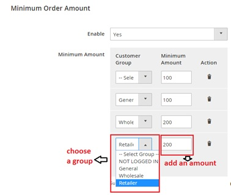
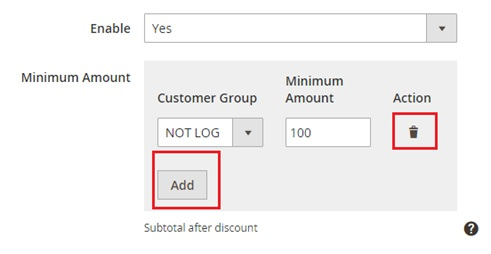
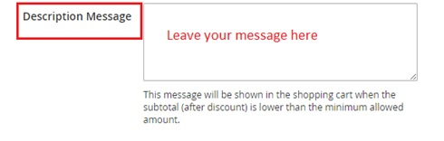
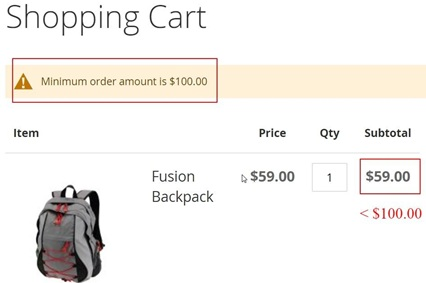

User Guide
=============

Minimum Order Amount For Customer Group Extension For Magento 2 Overview
--------------------------------------------------------------------------

`Minimum Order Amount For Customer Group Extension For Magento 2 <http://bsscommerce.com/magento-minimum-order-amount-for-customer-group-for-magento-2.html>`_  is 
developed from the initial version for Magento 1 to work well on Magento 2 platform. This extension allows admin to set a limitation of minimal order value for 
each group of customer. Customers will not be able to check out if they order a smaller amount of  value than required. This function is especially suitable for 
B2B e-commerce. Using this extension can help you reach greater revenue.

How does Minimum Order Amount For Customer Group For Magento 2 Extension work?
-------------------------------------------------------------------------------

This module can be easily configured on the backend. 
Check it in **Store -> Configuration -> Sales -> Sales**

1. Set the limitation
^^^^^^^^^^^^^^^^^^^^^^

You can customize customer groups and add the minimal amount of value you want to force for each group

You also can add more or delete a group as you wish.

2. Notify your customer
^^^^^^^^^^^^^^^^^^^^^^^

You can leave message for customers to notify them about your limitation.

When the module is enabled, when they do not order enough amount of value, your customer will see your message and cannot check out.

After they order enough, they can check out as usual.

.. raw:: html

   