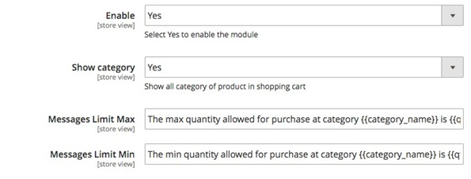

User Guide
=============

Min/Max Order Quantity per Category for Magento 2Overview
---------------------------------------------------------

Min/Max Order Quantity per Category for Magento 2 is a useful tool for online store owners to limit order quantity for all products in 
a category that each customer group has to meet before checking out successfully.

With the help of this module, Magento store owners can save up a lot of costs especially shipping costs or package costs. No need to worry 
about too small or too large number of order products each category, using this extension, admin can avoid all obstacles in managing order 
product quantify per categories.

How does Min/Max Order Quantity per Category for Magento 2 work?
----------------------------------------------------------------

Go to Store->Configuration->BSSCOMMERCE->Min/Max Order Quantity per Category for Customer Group to begin setting up

1.	In **Enable**: Choose **Yes** to enable the module or choose No to disable it

2.	In **ShowCategory**:

* Choose **Yes** to show product category in the shopping cart. Withproduct belonging to multiple categories, all those categories will be displayed regardless of where customer added the product tocart.

* Choose **No** to hide the productcategory.

3.	In **Messages Limit Max:** you can change the notification messages when maximum required order quantity per category is not met (This message locates at the top left 
corner of the Shopping Cart). Without any changes, default message will be shown as: The max quantity allowed for purchase at category{category_name} is {qty_limit} [ Product Name : {product_name} ]

4.	In **Messages Limit Min:** you can change the notification messages when minimum required order quantity per category is not met. Without any changes, default message will 
be shown as: The min quantity allowed for purchase at category {category_name} is {qty_limit} [ Product Name : {product_name}]

5.	In **Min/Max orderquantity:**

.. image:: images/minmax_order_quantity_m2_2.jpg

You can freely choose customer group and category to apply the min/max quantity rule. Click **Add** button for more options.

After finishing with setup, choose **Save Config**

** *Note:**

For products belong to multiple categories, the order quantity of products needs to meet the min/max requirement of all thosecategories.

The min/max rule is applied to the total number of products in each category added to cart, not the order quantity of each particular product.

.. raw:: html

   

