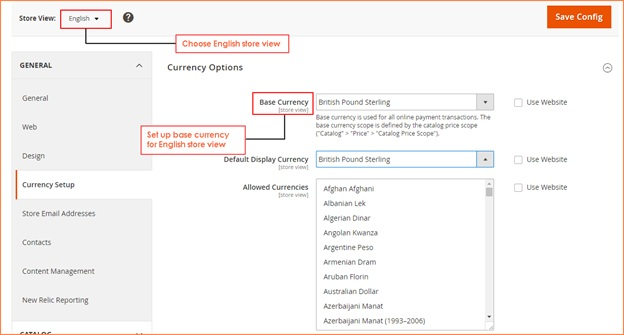
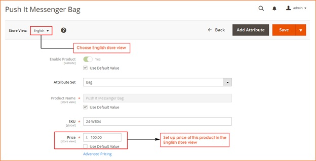

User Guide
=============

.. role:: italic

.. role:: euro

.. role:: pound

Multiple Store View Pricing for Magento 2 Extension Overview
-------------------------------------------------------------

`Multiple Store View Pricing for Magento 2 extension <http://bsscommerce.com/magento-multiple-store-view-pricing-for-magento-2.html>`_ helps store owners to 
set up different prices for the same product in various store views of a store while Magento 2 default does not support this function. For example, you want to 
sell a table at :pound:`50` in English store view but in the French store view, the price you want customers to pay is :euro:`80`. It all depends on demands of store owners 
as well as business strategies for each local target customers.

Moreover, this module also allows administrators to set up base currency for each store view so that customers can easily checkout with currency of store view. It 
can be said that this is really another very outstanding features of Multiple Store View Pricing for Magento 2 to make more convenient for both customers and 
store owners. 

How does Multiple Store View Pricing for Magento 2 Extension work?
------------------------------------------------------------------

1.	Enable Multiple Store View Pricing for Magento 2 Extension 
^^^^^^^^^^^^^^^^^^^^^^^^^^^^^^^^^^^^^^^^^^^^^^^^^^^^^^^^^^^^^^

You go to **Store** -> **Configuration** -> **Catalog**

Next, you continue to click **Catalog** section and among all sections shown up in the page, find **Price** section to start the customization. 

.. image:: images/multi_store_pricing_m2.jpg 

In box **Catalog Price Scope**, there are 3 options for admin to choose: :italic:`Global, Website and Store View`.  You choose :italic:`Store View` to enable the module. 

Then you click **Save Config** and begin to customize prices of products in each store view of each store

2.	Set up base currency for each store view 
^^^^^^^^^^^^^^^^^^^^^^^^^^^^^^^^^^^^^^^^^^^^

**2.1. Set up base currency for English store view**

In **Configuration**, you go to **General** -> **Currency Setup** to set up base currency for English store view 

Choose **English** store view from **Store View** Section

In **Base Currency**: Choose **British Pound Sterling** as base currency and customers will use this one to checkout. 

In **Default Display Currency**: you can choose **British Pound Sterling** or any other currency because this one is only displayed in the product or 
category page, not used in the checkout. 

In **Allowed Currencies**: Choose **British Pound Sterling**

Then, click to **Save config** and start to set up price for a product in the English store view

**2.2. Set up base currency for French store view**

In **Configuration**, you go to **General** -> **Currency Setup** to set up base currency for French store view 

Choose **French** store view from **Store View** Section

.. image:: images/multi_store_pricing_m2_2.2.jpg

In **Base Currency**: Choose **Euro** as base currency and customers will use this one to checkout. 

In **Default Display Currency**: you can choose **Euro** or any other currency because this one is only displayed in the product or category page, not used in 
the checkout. 

In **Allowed Currencies**: Choose **Euro**

Then, click to **Save config** and start to set up price for a product in the French store view

3.	Set up different prices for a product in store views of a store 
^^^^^^^^^^^^^^^^^^^^^^^^^^^^^^^^^^^^^^^^^^^^^^^^^^^^^^^^^^^^^^^^^^^

**3.1. Set up price for a product in the English store view: Put It Messenger Bag, for example**

**Step 1**: Choose **English** in **Store View** box

**Step 2**: In **Price** section, you unmark "**Use Default Value**" and add your wanted price for the product in this English store view: :pound:`100`, for instance 

In addition, you can also set up **Special Prices** for this product by clicking **Advanced Pricing** 

Finally, you save configuration and continue to set up price in the other store view 

**3.2. Set up price for a product in the French store view: Put It Messenger Bag, for example**

.. image:: images/multi_store_pricing_m2_3.2_1.jpg

**Step 1**: Choose **French** in **Store View** box

Step 2: In **Price** section, you unmark "**Use Default Value**" and add your wanted price for the product in this French store view: :euro:`200`, for instance 

Finally you save configuration in go to the frontend to see the changes: 

* **Price of Put It Messenger Bag in the English store view**:

.. image:: images/multi_store_pricing_m2_3.2_2.jpg

* **Price of Put It Messenger Bag in the French store view**: 

.. image:: images/multi_store_pricing_m2_3.2_3.jpg

As a result, you can set up different price for a product: **Put It Messenger Bag** in two store views

.. raw:: html

   

