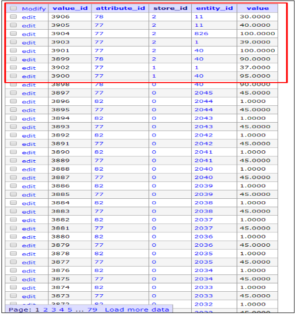
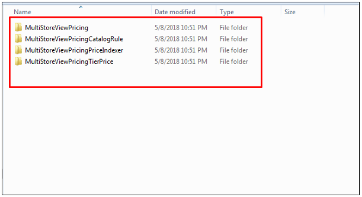

Uninstallation Guide
=============

Magento 2 Multiple Store View Pricing
-------------------------------------------------------------

Step 1: Change Price Scope to Global
^^^^^^^^^^^^^^^^^^^^^^^^^^^^^^^^^^^^^^^^^^^^^^^^^^^^^^^^^^^^^^^^^^

You go to **Admin** and navigate to **Store→ Configuration→ Catalog→ Catalog→ Price.** 
In **Catalog Price Scope**, you select **Global**.

Step 2: Remove EAV attributes and tables that this extension adds to database
^^^^^^^^^^^^^^^^^^^^^^^^^^^^^^^^^^^^^^^^^^^^^^^^^^^^^^^^^^^^^^^^^^^^^^^^^^^^^^^^^^^^^^^

***Note**: You should backup your database before removing.

* Remove **tier_price_config_for_store** and **tier_price_for_store** attributes in the **eav_attribute** table of database.
* Remove tables that this extension adds to database.

	- catalog_product_index_price_store
	- catalogrule_product_price_store
	- catalog_product_index_price_store_idx
	- catalog_product_index_price_store_tmp
	- catalog_product_index_price_final_store_tmp
	- catalog_product_index_price_final_store_idx
	- catalog_product_index_price_bundle_store_idx
	- catalog_product_index_price_bundle_store_tmp
	- catalog_product_index_price_bundle_sel_store_idx
	- catalog_product_index_price_bundle_sel_store_tmp
	- catalog_product_index_price_bundle_opt_store_idx
	- catalog_product_index_price_bundle_opt_store_tmp
	- catalog_product_index_price_cfg_opt_agr_store_idx
	- catalog_product_index_price_cfg_opt_agr_store_tmp
	- catalog_product_index_price_cfg_opt_store_idx
	- catalog_product_index_price_cfg_opt_store_tmp
	- catalog_product_index_price_downlod_store_idx
	- catalog_product_index_price_downlod_store_tmp
	- catalog_product_entity_tier_price_store
* Remove rows whose **store_id** values are not 0 in the **catalog_product_entity_decimal** table.

Step 3: Remove code of this module in the BSS folder.
^^^^^^^^^^^^^^^^^^^^^^^^^^^^^^^^^^^^^^^^^^^^^^^^^^^^^^^^^^^^^^^^^^^^^^^^^^^^^^^^^^^^^^^

Step 4: Run Reindex by SSH
^^^^^^^^^^^^^^^^^^^^^^^^^^^^^^^^^^^^^^^^^^^^^^^^^^^^^^^^^^^^^^^^^^^^^^^^^^^^^^^^^^^^^^^

Run this command: **php bin/magento indexer:reindex**
