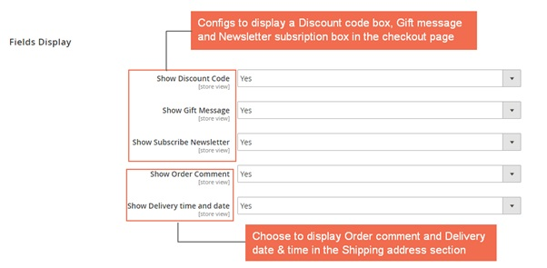
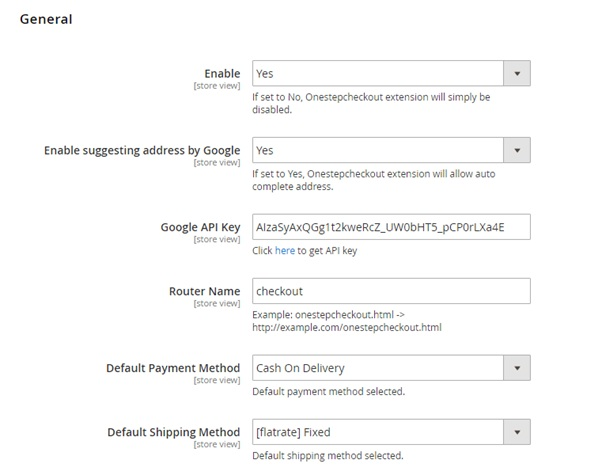

User Guide
=============

One Step Checkout for Magento 2 Overview
-----------------------------------------

`One Step Checkout for Magento 2 extension <http://bsscommerce.com/magento-2-one-step-checkout.html>`_ helps customers to checkout simply and quickly by 
displaying all elements in 1 page only. They do not need to experience two parts (Shipping Address and Reviews & Payments) as in Magento 2 default, but fill 
all information in one place conveniently. Therefore, the checkout process becomes more user friendly, which can reduce abandonment rate and bring higher 
conversion rate for online stores. 

How Does One Step Checkout for Magento 2 Work?
----------------------------------------------

Please go to **Store -> Configuration -> BSS ONESTEPCHECKOUT -> One Step Checkout**

1. In Fields Display 
^^^^^^^^^^^^^^^^^^^^

In **Show Discount Code:**

	*	Choose Yes to display a box to enter discount code.
	
	*	Choose No to hide this box from the checkout page. 

In **Show Gift Message:**

	*	Choose Yes to show Gift options that let customers to add their own gift messages. 
	
	*	Choose No to disable this function.

In **Enable Subscribe Newsletter:**

	*	Choose Yes to allow customers to subscribe newsletter in the checkout page. 
	
	*	Choose No to disbale this option. 

In **Enable Order Comment:**

	*	Choose Yes to show a text box for customers to leave their comments for order
	
	*	Choose No to exclude this box from the checkout page 

In **Enable Delivery time and date:**

	*	Choose Yes to display Order delivery date and time that allows customers to choose their own suitable dates and times to receive orders.
	
	*	Choose No to disable this funtion. 

2. In General 
^^^^^^^^^^^^^
	

In **Enable:**

	*	Choose Yes to enable Magento 2 One Step Checkout extension. 
	
	*	Choose No to disable this module.

In **Enable suggesting address by Google:**

	*	Choose Yes to enable the address suggesting function of Goole. It will suggest customer addresses when they type some letters. 
	
	*	Choose No to disable this function.

In **Google API Key**: Fill in your API Key.

In case you haven't yet had an API Key, please click the link after this configuration to get it.

In **Router Name**: Choose your wanted url  name for your checkout page. 
	
In **Default Payment Method**:  Select default payment method.

In **Default Shipping Method**: Select default shipping method.
	
.. raw:: html

   

