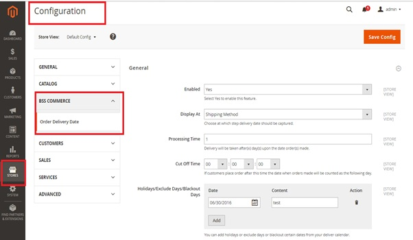
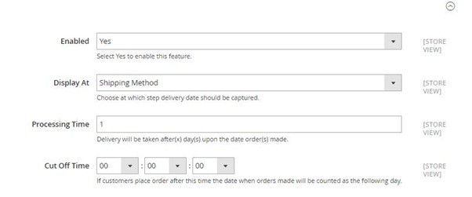
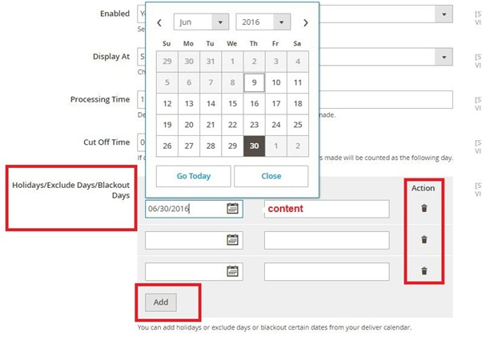
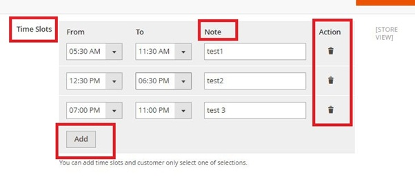
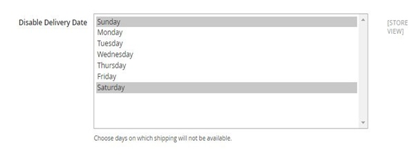
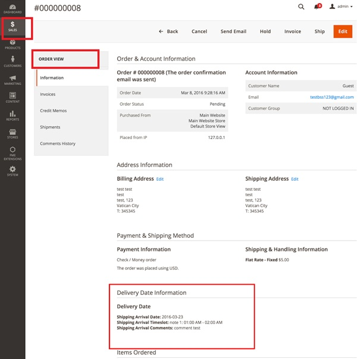
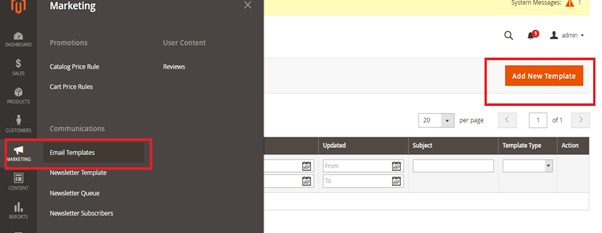
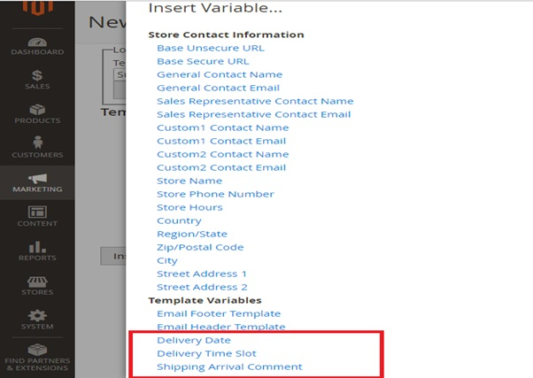

User Guide
=============

.. role:: bullet

Order Delivery Date for Magento 2 Extension Overview
----------------------------------------------------

With help of `Order Delivery Date for Magento 2 Extension <http://bsscommerce.com/magento-configurable-product-grid-table-view-for-magento-2.html>`_ , shipment 
information for every order from your Magento 2 based websites will be more detailed and clearer than ever. In the fron-end, customers can choose 
the exact **dates** and **time slots**; even leave a **comment** about it. In the back-end, website admin can easily control his own conditions to build 
timing options for customers, including: Processing Time, Cut-off Time, Holidays/Exclude days/Blackout days, Time slots, Disable Delivery Date

How does it work?
-----------------

1.	Set up Delivery Order Date in the back-end
^^^^^^^^^^^^^^^^^^^^^^^^^^^^^^^^^^^^^^^^^^^^^^

Order Delivery Date for Magento 2 offers store owners an easy way to set up and control advanced delivery time choices for their customers' orders. 
In Admin Panel, navigate to the section of this extension: **Stores** :bullet:`Configuration` :bullet:`BSS Commerce` :bullet:`Order Delivery Date`

**At "Enabled" field**, you just simply select Yes/No to turn on or off this extension from taking effects.

**"Display At"** is the section that lets you decide where the part for customers fill in details about delivery dates will be shown: Shipping method, Product 
Page or Order Review

**"Processing Time"** is the number of days from the time an order is placed in the website until when the delivery can begin. If you set it as 1 day, then a 
customer placing an order today has his options of delivery date start from tomorrow

**"Cut Off Time"** is set up as a point of time in the day when order made after that will be counted as being made on the next day

**"Holidays/Exclude Days/Blackout Days"**: These are the days that are not available for delivery picked in the calendar by admin. They will be faded in 
the delivery calendar shown for customers and of course, they cannot be selected. Admin can add more unavailable days like that by click the button "Add" or 
delete them by clicking on trash bin icon under column "Action". Content for each one may be filled in, the reason for its out-of-options status for instance.

There are "Time Slots" to set up delivery time more exactly by hours in the day. You can also Add new time slots or Delete them, and write a note for each one just in similar way to what you do with Holidays/Exclude Days/ Blackout Days before.
In "Disable Delivery Date" section, you can fix the days in every week that are not available for delivery options.

2.	Insert Order Delivery Date Information into Orders, Invoices, Shipments, Credit Memos and emails
^^^^^^^^^^^^^^^^^^^^^^^^^^^^^^^^^^^^^^^^^^^^^^^^^^^^^^^^^^^^^^^^^^^^^^^^^^^^^^^^^^^^^^^^^^^^^^^^^^^^

Besides allowing a very detailed timing customization, Order Delivery Date for Magento 2 Extension also add customers' Delivery Date, Time Slots and Arrival 
Comments directly to **Orders/Invoices/Shipments/Credit Memos info** in the backend for admin to keep tracking more easily. To check it, from Admin Panel you 
go to **Sales** section and choose which one you want to see. Opening every single order/invoice/ shipment/credit memo you will see the added part of this module.

As for Emails, Order Delivery Date for Magento 2 Extension automatically adds Delivery Date, Time slots and Arrival Comments as given by customers 
into email variables so that when creating an email template, you can use this information if needed. To do so, from Admin Panel you go to 
**Marketing** :bullet:`Email Templates` :bullet:`Add new template`

After loading default template, in Template Information section, click **Insert Variable…** then you will see added variables added by this module

When you continue to send emails to your customers as usual using the templates that were just created, Delivery Date, Delivery Time Slot and Shipping Arrival 
Comment will be included.

.. raw:: html

   

