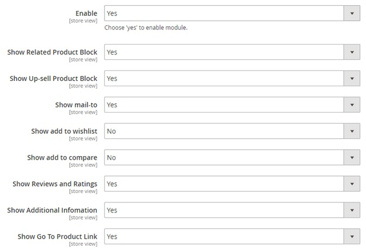

User Guide
=============

Quick View for Magento 2 Extension Overview
-------------------------------------------

`Quick View for Magento 2 Extension <http://bsscommerce.com/magento-2-quick-view.html>`_ allows customers to check preview of products and add products to 
cart in Quick View popup without visiting product page. Besides, customers can also execute other actions just like in a real product page, such 
as: add products to compare, wish list, send email, write review and check related/up-sell products. Admin can easily settings and design of Quick View Popup. 

How Does Quick View for Magento 2 Extension Work?
-------------------------------------------------

Please go to **Store -> Configuration -> Ajax Quick View**

1. General  
^^^^^^^^^^^^

In **Enable**, choose Yes to enable the extension or No to disable it.

In **Show Related Product Block**, choose Yes to include related product block in Quick View popup, or No to exclude this information. 

In **Show Up-sell Product Block**, choose Yes to include up-sell product block in Quick View popup, or No to exclude this information. 

In **Show Mail-to**, choose Yes to enable mail-to option in Quick View popup, or No to leave it out. 

In **Show Add to Wishlist**, choose enable add to wish list option in Quick View popup, or No to leave it out. 

In **Show Add to Compare**, choose enable add to compare option in Quick View popup, or No to leave it out. 

In **Show Review and Ratings**, choose Yes to include review and ratings in Quick View popup, or No to exclude this information. 

In **Show Additional Information**, choose Yes to include addition information (product detail block) in Quick View popup, or No to exclude this information. 

In **Show Go To Product Link**, choose Yes to enable Show Go To Product link in Quick View popup, or No to leave it out. 

2. Quick View Popup Design  
^^^^^^^^^^^^^^^^^^^^^^^^^^^
	

In Button Text Color, set color for text on Quick View button.

In Button Text, enter text for Quick View button. Eg: Quick View, View Product…

In Button Color, set color for Quick View button.

	
.. raw:: html

   

