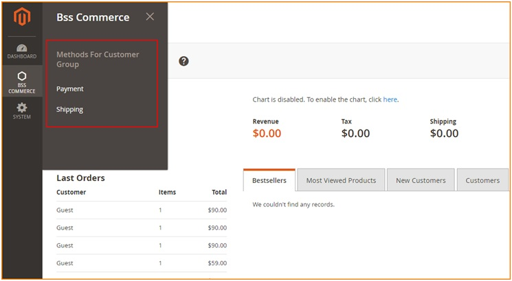
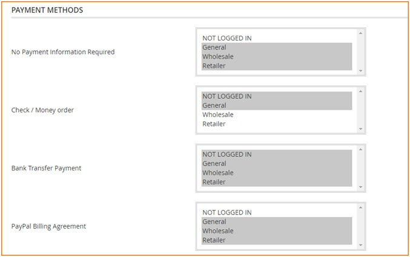
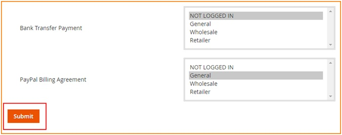
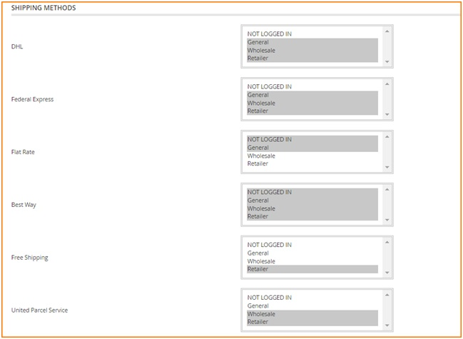
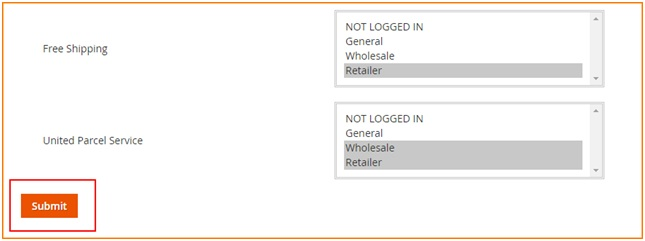

User Guide
=============

Shipping and Payment per Customer Group for Magento 2 Extension Overview
------------------------------------------------------------------------

`Shipping and Payment per Customer Group for Magento 2 <http://bsscommerce.com/magento2-shipping-and-payment-method-per-customer-group.html>`_ allows 
admin to assign shipping and payment methods to specific customer groups, thus promotes better order management and faster customer checkout process.

How does Shipping and Payment per Customer Group for Magento 2 Extensionwork?
-----------------------------------------------------------------------------

Please go to **BSS COMMERCE -> Methods for Customer Group -> Payment / Shipping**

1.	InPayment
^^^^^^^^^^^^^

In **Payment Methods**, choose one or multiple customer groups in each of enabled payment methods available.

Then, click **Submit button** to save all figuration.

2.	InShipping
^^^^^^^^^^^^^^

In **Shipping Methods**, select one or multiple customer groups in each of enabled shipping methods available.

Then, click **Submit button** to save all figuration.

.. raw:: html

   

