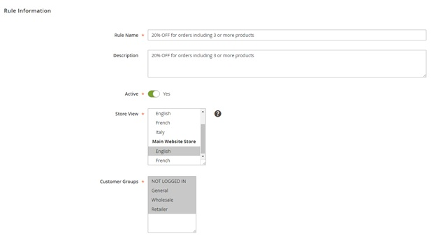
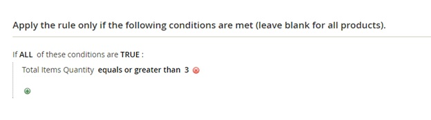
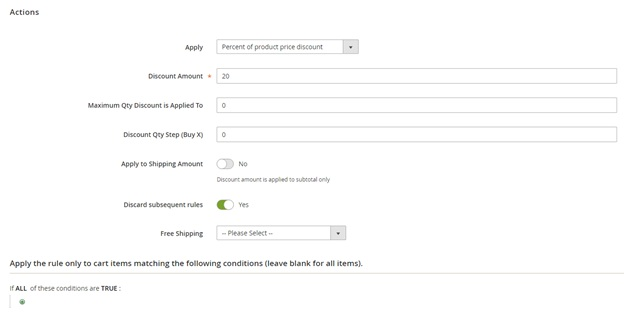
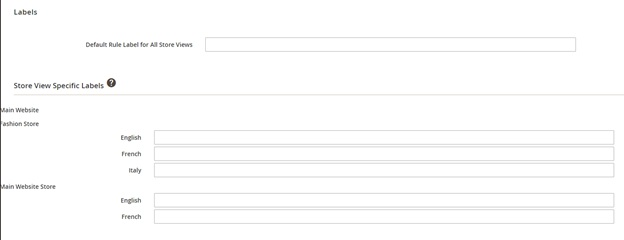
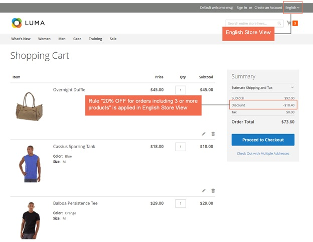
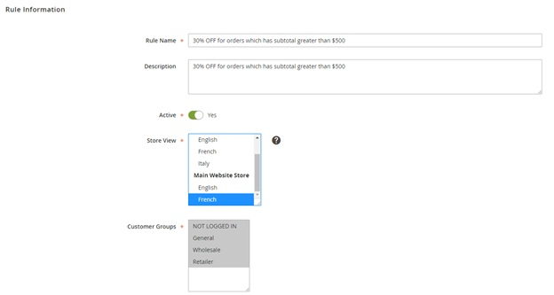
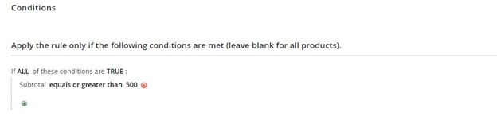
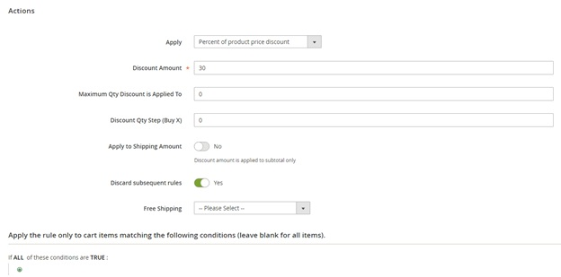
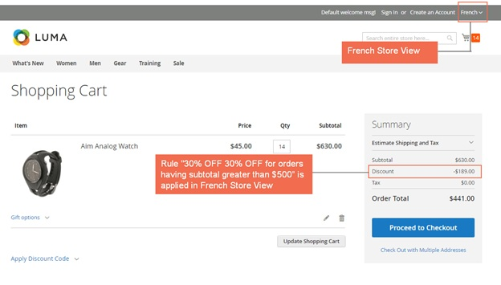

User Guide
=============

.. role:: remark

Shopping Cart Price Rule per Store View for Magento 2 Overview
--------------------------------------------------------------

`Shopping Cart Price Rule per Store View for Magento 2 <http://bsscommerce.com/shopping-cart-price-rule-per-store-view-for-magento-2.html>`_ helps 
administrators to set up shopping cart price rule for store views, instead of the whole website as Magento default. Therefore, store owners can provide 
their local customers particular promotions programs to encourage them to purchase more and enhance sales effectively.  

How Does Shopping Cart Price Rule per Store View for Magento 2 Work?
--------------------------------------------------------------------

After installing this module, you will select store views to set up cart price rules when you create new rules. 

You go to **MARKETING -> Cart Price Rules -> Add New Rule.** 

You fill in necessary information in sections of **Rule information**. Especially, in **Store View** section, you will select store views to set up this rule 
and apply in the frontend. You can select multiple store view to carry out setup at one time. 

Take 2 following examples to see how Shopping Cart Price Rule per Store View for Magento 2 can function in details. 

**Example 1: Set up a rule "20% OFF for orders including 3 or more products" for English store view.**

	**In Rule Information:**
	
	*	Fill in Rule name and Description.
	
	*	Set Yes for Active.
	
	*	Select English of Main Website Store  in Store View section. 
	
	*	Select customer groups to apply. 

	.. image:: images/shopping_cart_rule_store_view_2.jpg
	
	*	Set up Coupon, Uses per Customers, Valid Time and Priority for this rule.

In **Conditions:** Set up the right condition for this rule.

In **Actions**: Choose suitable actions for the rule. 

In **Labels**: Write a label for each store view to specify which promotion is being applied.

Finally, you save the rule and see how it is applied in the frontend:

**Example 2:  Set up a rule "30% OFF for orders which has subtotal greater than $500" for French store view.**

You do the same steps as in Example 1 but you need to choose French store view to set up in Store Views section.  

In **Conditions**:

In **Actions**:

Finally, you save the rule and see how it is applied in the frontend: 

:remark:`*Note`: For more understandings about how to create a shopping cart price rule for Magento 2, you can take a look at our following tutorial: 
	
`How to Create Shopping Cart Price Rule for Magento 2 <http://bsscommerce.com/blog/how-to-create-shopping-cart-price-rule-in-magento-2/>`_
	
	
.. raw:: html

   

