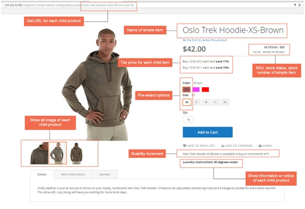
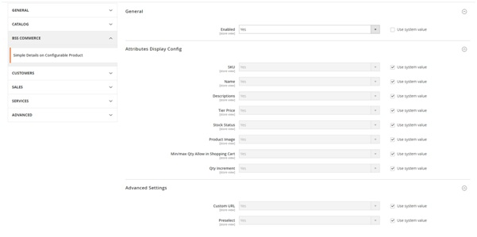

User Guide
=============

Simple Details on Configurable Product for Magento 2 Overview
-------------------------------------------------------------

`Simple Details on Configurable Product for Magento 2 <https://bsscommerce.com/simple-details-on-configurable-product-for-magento-2.html>`_ supports showing 
all detailed information of each child product when choosing options,namely SKU, name, tier price, stock status, stock number, description and URL. Therefore, this 
extension is absolutely suitable for those selling configurable product with many different children products or for business purpose of each child item.

How does Simple Details on Configurable Product for Magento 2Extension work?
----------------------------------------------------------------------------

1. In the frontend
^^^^^^^^^^^^^^^^^^

This is how Simple Details on Configurable Product is displayed in the fronted:

* Show details of children items of configurable product, such as: name, SKU, tier price, stock status, stock number and description.
* Get URL for each child product with preselected options.

	* URL: URL will change as chosen options. If customers access to the URL, options are also selected in the product page.
	* Custom URL has a form: .../Product-Name+attr1-Value1+attr2-Value2 (For instance:  .../hero-hoodie+color-Black+size-S), it changes when choosing attributes of product.

* Support minimum quantity for product separately added to cart instead of the default of Magento 2, which only allows for configurable products.
* Support quantity increment for children products. This function outweighs the default with ability to set increment for each associated product of configurable product. For example, if you set 5 for quantity increment for a skirt-red-L, then your customer cannot buy this item with quantity 1-2-3 or 6-7-8 only choose this product with 5-10-15 etc in quantity box.

2. In the backend
^^^^^^^^^^^^^^^^^

In **General**:

	* Enabled: choose Yes to enable the module.

In **Attributes Display Config**: choose Yes to show the attributes you want in the frontend:

	* SKU
	* Name
	* Description
	* Tier Price
	* Stock Status
	* Product Image
	* Min/Max Quantity Allow in shopping cart: this default feature now can support for simple products individually. Edit each child item page in the backend to set minimum or maximum quantity.
	* Quantity Increment:  this feature of Magento default now supports every simple product of configurable product. Edit each simple product to set quantity increment.
	
In **Advanced Settings**:
	
	* Custom URL: choose Yes to enable this feature.
	
	:step:`*Note`: in this configuration, if you want to get a new URL for simple product, you can type URL as you wish in the box **(Do not have neither '+' nor '~')**; or you can 
	let it blank and tick on checkbox as image below to take the URL of configurable product.

	.. image:: images/simple_details_on_configurable_products_m2_3.jpg

	* Preselect: the attributes are preselected in the product detail page in the backend. Go to product details page in the backend, preselect option of attributes.
	
	.. image:: images/simple_details_on_configurable_products_m2_4.jpg
	
	:step:`*Note`: in Magento 2.0.x version, there will be a separate Preselect tab in product detail page:
	
	.. image:: images/simple_details_on_configurable_products_m2_5.jpg
	

	
.. raw:: html

   

