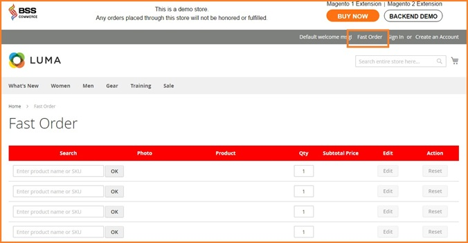
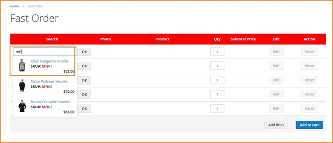
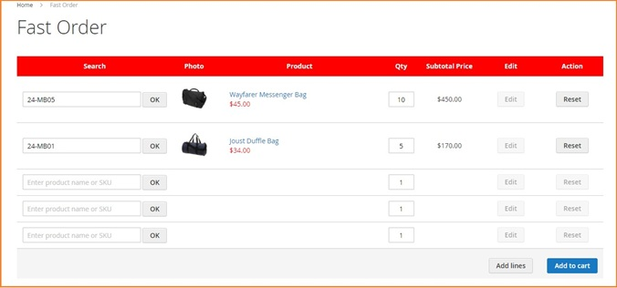
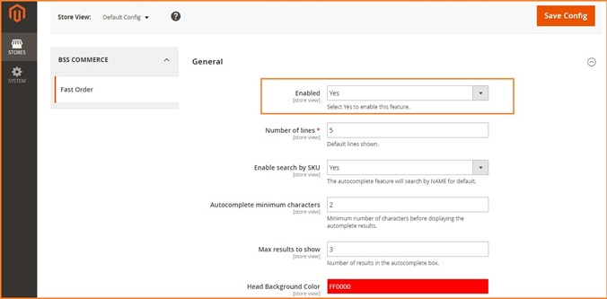
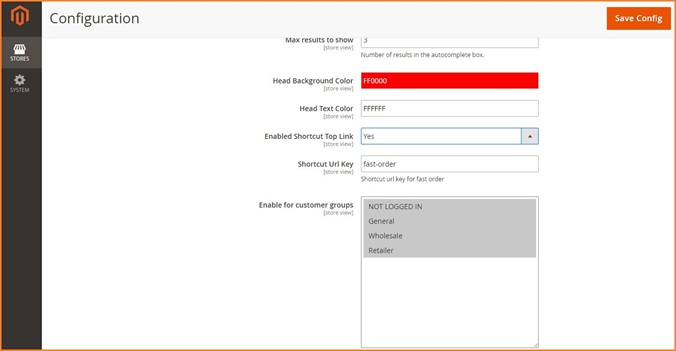

User Guide
=============

Overview Of Wholesale Fast Order For Magento 2 Extension
---------------------------------------------------------

The `Wholesale Fast Order For Magento 2 Extension <http://bsscommerce.com/magento-2-wholesale-fast-order.html>`_ can assist customers in purchasing 
a large number of multiple products and adding all of them to cart at once instead of spending lots of time to order each one of products then adding to 
shopping cart. Therefore, with this magento 2 extension developed by BSS Commerce, online wholesalers will be no longer delayed even one second while purchasing. 

How does Wholesale Fast Order For Magento 2 Extension work? 
-----------------------------------------------------------
 
1.	How to use functions of Wholesale Fast Order For Magento 2 Extension 
^^^^^^^^^^^^^^^^^^^^^^^^^^^^^^^^^^^^^^^^^^^^^^^^^^^^^^^^^^^^^^^^^^^^^^^^^

`Wholesale Fast Order For Magento 2 <http://bsscommerce.com/magento-2-wholesale-fast-order.html>`_ is a very useful extension that allows selecting multiple 
products at the same time and then adding them to shopping cart without spending too much time purchasing one by one. By this 
way, `Wholesale Fast Order For Magento 2 <http://bsscommerce.com/magento-2-wholesale-fast-order.html>`_ can optimize order process and decrease buying time 
by following these steps:   

**Step 1**: Click **"Fast Order"** shortcut in the right side of the website

* Fast Order shortcut will be displayed in the right side of your Magento site when you installed `Wholesale Fast Order For Magento 2 <http://bsscommerce.com/magento-2-wholesale-fast-order.html>`_
	
* Customers click to Fast Order shortcut and there is a Fast Order CMS page for them to search
  

**Step 2**: Search products by typing names or SKU in the search boxes 

There will be several suggestions as you set up for customers to choose. Both names and SKUs are included in the search results with the highlighted search keyword.   

As you can see, it also supports autocomplete  

**Step 3**: Select your wanted products with quantity and add them to cart  

For configurable products, there will be a popup of custom option attributes for customers to choose. Evenmore, if your customers want to edit product 
attributes or other custom options, they just need to click on **"EDIT"** button 

.. image:: images/wholesale_fast_order_m2_1_4.jpg

If they want to get more lines for searching and ordering, they can click on **"Add lines"** button at the right bottom of the ordering table 

**Step 4**: Customers can also view your shopping cart page to see chosen products  

**Step 5**:  Process to checkout right after adding products into cart. The grand total will be automatically calculated as you add multiple desired items to 
cart at a time.  

2.	How to configure Wholesale Fast Order For Magento 2 Extension in the backend
^^^^^^^^^^^^^^^^^^^^^^^^^^^^^^^^^^^^^^^^^^^^^^^^^^^^^^^^^^^^^^^^^^^^^^^^^^^^^^^^^

* For Admin Configuration, go through **"Stores -> Configuration -> BSS Commerce -> Fast Order".**

* In **Enabled**: You can switch on/switch off `Wholesale Fast Order For Magento 2 <http://bsscommerce.com/magento-2-wholesale-fast-order.html>`_ by choosing **Yes** or **No** it in the back end.  

* In **Number of lines**: you set the number of lines of Fast Order shown in the CMS page 

* In **Enabled search by SKU**:   

	+ Choose **Yes** to enable customers to search by SKUs   
	
	+ Choose **No** and customers can only search by names as default  
	
* In **Autocomplete minimum characters**: you set the minimum characters customers have to type in the search box so that the result can appear.  

* In **Max results to show**: you set the number of results displayed in the autocomplete box  

* In **Head Background Color and Head Text Color**: you can choose which color as you wish for your ordering table on the CMS Page to get more attraction from your customers 

* In **Enabled Shortcut Top Link:** 

	+ Choose **Yes** to enable shortcut top link -> Then there will be a **Shortcut Url Key** box for you to type the name for the shortcut url.
	
	+ Choose **No** if you want to disable it 
* In **Enable for customer groups**: you choose group for whom you do not want to enable Wholesale Fast Order  

.. raw:: html

   

